<!-- .slide: data-background-color="#000000" data-background-image="assets/img/mnm-histogram.png" data-background-opacity="0.13" -->
# Langages de programmation à l'ère de l'IA générative
## COBOL, M&M's, français… ou peu importe ?

🎙️ Mathieu Acher

<div class="logos">


</div>

<p class="smaller" style="margin-top: 0.5em">blog.mathieuacher.com · 𝕏 @acherm · ▶ @CodeplAI</p>

<span class="smallest">Vendredi 4 septembre 2026 · Semaine de l'IA · Université de Rennes<br>intelligence-artificielle.univ-rennes.fr/semaine-ia-2026</span>

Note: Bienvenue. Ce matin on va parler de programmation, mais probablement pas comme vous l'imaginez.

---

<!-- .slide: data-visibility="uncounted" -->
## Résumé

<div class="abstract">

À l'ère de l'IA générative et du *vibe coding*, programmer peut commencer par une simple description en langue naturelle, en anglais ou en français, de ce que l'on souhaite obtenir. Des agents de codage peuvent aujourd'hui produire des sites web, des jeux, des solveurs, voire des compilateurs ou des outils plus ambitieux, avec des résultats parfois impressionnants. Pour tester leurs limites, on peut les confronter à des langages très différents : Python, Rust ou JavaScript, mais aussi COBOL, l'un des plus vieux langages encore utilisés, Brainfuck, un langage composé de seulement 8 caractères, ou même un langage à base de M&Ms.

Ces expériences donnent lieu à des démonstrations étonnantes : un jeu DOOM en COBOL, un jeu d'échecs en Brainfuck ou des programmes non triviaux écrits avec des bonbons colorés. L'intérêt est que ces programmes ne sont pas de simples copies retrouvées quelque part : ils sont générés à chaque fois, avec leurs propres choix, leurs surprises, leurs réussites et leurs défauts. Car tout ne fonctionne pas toujours : le programme peut être incorrect, fragile, incomplet, ou faire ce qui est demandé de manière très maladroite (par exemple jouer très mal aux échecs).

Derrière le spectacle, une question demeure : les langages de programmation vont-ils **disparaître**, ou devenir au contraire **encore plus importants** pour préciser, contrôler et comprendre ce que l'IA produit ?

</div>

Note: Le résumé officiel de l'exposé, tel qu'annoncé dans le programme de la Semaine de l'IA 2026. Slide non comptée dans la numérotation (data-visibility="uncounted") pour ne pas décaler les repères de TIMELINE.md et de chrono.html.

---

## Au programme de ce matin

- Un **jeu de tir 3D** codé avec un enfant de 10 ans 🎮
- Un moteur d'**échecs en Brainfuck** (un langage à 8 caractères) ♟️
- Des programmes écrits en **M&M's** 🍬
- **DOOM en COBOL** (le langage de votre banque, né en 1959) 👾
- Et une vraie question de fond ⤵

> Les langages de programmation vont-ils **disparaître**, ou devenir **encore plus importants** pour préciser, contrôler et comprendre ce que l'IA produit ?

Note: Annonce du menu : du spectaculaire, mais chaque démo porte une question scientifique sérieuse. La question : on y répondra à la fin, données à l'appui, et la réponse n'est pas celle des prophètes de la « fin du code ».

---

<!-- .slide: data-background-color="#0d3b66" data-background-image="assets/img/fifacher-stade-raoul-brulat.jpg" data-background-opacity="0.35" class="section-slide" -->
# 1. Programmer en français
## Call of Acher & FIFAcher : le « vibe coding » en famille

Note: ⏱ T+2 (bloc 1, 8 min) — Première partie : une expérience très personnelle de l'été dernier.

---

## Été 2026, une semaine de vacances

<div class="cols" style="align-items: center">
<div style="flex: 1.25; text-align: left">

- Un chercheur en génie logiciel 👨‍🔬
- Son neveu de **10 ans**, qui n'a jamais programmé 🧒
- Un agent de codage (Claude Code) 🤖
- Objectif : **« on veut notre Call of Duty et notre FIFA »**

**Zéro ligne de code écrite à la main.**

</div>
<div style="flex: 0.75">
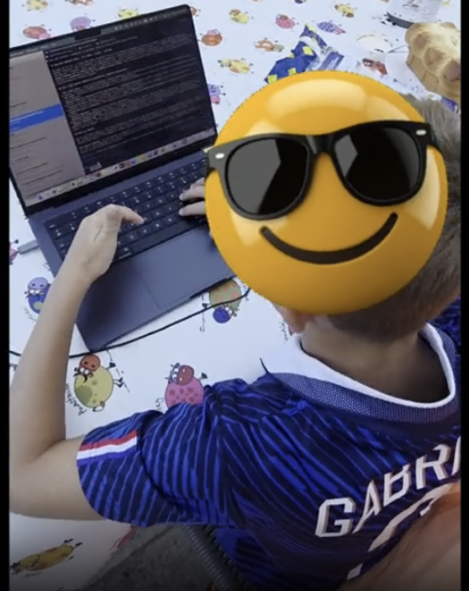
</div>
</div>

Note: Le neveu est le client et le co-designer. Toute l'interaction se fait en français, à l'oral quasiment : on dicte ce qu'on veut.

---

## ASHFALL 🎮

<div class="cols" style="align-items: center">
<div style="flex: 1.7">
<video src="assets/videos/ashfall-desktop.mp4" data-autoplay muted controls loop style="max-height: 555px; width: 100%"></video>
</div>
<div style="flex: 0.42">
<video src="assets/videos/ashfall-mobile.mp4" data-autoplay muted loop style="max-height: 500px; width: 100%"></video>
<p class="smallest">…et sur mobile</p>
</div>
</div>

Note: Vidéo du FPS : coop 2 joueurs, véhicules, décors bretons. Jouable sur blog.mathieuacher.com/ashfall/.

---

## Ce qu'il y a dedans

<div class="cols">
<div>

- FPS **coopératif 2 joueurs**, véhicules pilotables
- **Plusieurs décors** : Vallée de Gandy, Stade Vélodrome, Saint-Aubin-du-Cormier (étang, ruines du château), une ville en ruines…
- Desktop **et** mobile (joysticks tactiles)
- GitHub Pages : **zéro serveur**
- Three.js, assets 100 % procéduraux

</div>
<div>

<p class="smallest">Mode « MARQUEZ CONTRE LES RONALDO »</p>
</div>
</div>

Note: Tout est procédural : pas un seul asset téléchargé. ~18 900 lignes de JavaScript en 19 modules ES. La variante CR7 (photo) : idée du neveu : on ne tire pas des balles, on tire des ballons de foot sur des CR7.

---

## FIFAcher ⚽

<div style="display: flex; justify-content: center; margin-top: 0.1em">
<video src="assets/videos/fifacher-mobile-zoom.mp4" data-autoplay controls loop style="width: 860px; max-width: 90%; border-radius: 10px"></video>
</div>

<div class="cols" style="align-items: center; margin-top: 0.3em; gap: 1.1em; padding: 0 0.6em">
<div style="flex: 0.4">
<video src="assets/videos/fifacher-desktop.mp4" data-autoplay muted loop style="width: 100%; border-radius: 8px"></video>
<p class="smallest" style="margin: 0.1em 0 0">…et sur ordinateur</p>
</div>
<div style="flex: 1.6; text-align: left">
Le « <b>Stade Raoul Brulat</b> », 11 « Acher », des sponsors fictifs, et <b>2 joueurs « cheatés »</b> 🥅. Coût <i>cognitif</i> marginal de la personnalisation : <b>des phrases</b> (des prompts, quoi) 😉
</div>
</div>

Note: Aucun studio ne développerait ça : hyper-personnalisation à coût quasi nul (private jokes dans les commentaires ; tir surpuissant, le gardien adverse se troue). Le jeu de foot. Noter la foule : des dizaines de milliers de supporters dans un seul InstancedMesh, un seul draw call.

---

## Le client-développeur en action 🎬

<video src="assets/videos/neveu.mp4" data-autoplay controls style="max-height: 540px;"></video>

Le workflow compris en **10 minutes**, sans jamais demander à voir le code.

Note: Il formule ses demandes, teste, râle, re-demande : du génie logiciel sans le savoir. Montrer le naturel de l'interaction.

---

## Tout commence par un prompt

<blockquote style="text-align:left; font-size: 0.66em; line-height: 1.45; width: 97%">
I want you to build a first-person shooter at the level of the most recent Call of Duty games. It should be utterly perfect, visually beautiful, with every single thing done at AAA quality—from textures to physics to anything you could think of.
<br><br>
<b>Fan out sub-agents</b> and have sub-agents tackle each one individually so that the game is utterly perfect. You should /loop on each item and have a separate sub-agent check it visually to ensure it looks triple A. That separate sub-agent should be <b>a really harsh critic</b>, and if it doesn't look triple A, it should keep going.
<br><br>
Don't stop until each sub-agent is utterly wowed with the quality when compared with the actual Call of Duty game. It should literally compare them side by side blind and say which one looks better. Do this in ThreeJS. <b>/loop until it's utterly perfect.</b> Fan out sub-agents and ultracode.
</blockquote>

<p class="smaller">Le prompt de Matt Shumer (« Claude of Duty »), repris tel quel comme point de départ.</p>

Note: Prompt intégral et verbatim (github.com/mshumer/Claude-of-Duty). À souligner : il ne décrit presque rien du jeu : il décrit un PROCESSUS (sous-agents, critique impitoyable, boucle). Tout le contenu du jeu viendra ensuite, par conversation.

---

## La fabrique : la console Claude Code

<video src="assets/videos/console.mp4" data-autoplay muted controls style="max-height: 495px;"></video>

Les prompts du quotidien sont **très courts** : quelques mots suffisent, l'agent fait le reste.

Note: Vidéo de la console en action (deux captures enchaînées, fondu 1 s, sans le son). Point de bascule possible vers une démo LIVE de la console ; cette slide sert aussi de filet de sécurité.

---

## Sous le capot 🏭

- **60 requêtes** utilisateur, **92 sous-agents**, et l'agent se critique par **captures d'écran**

<span class="big" style="font-size: 2em">1,15 milliard <small>de tokens traités ; 0,19 % seulement deviennent du code</small></span>

> « On ne paie pas la fonctionnalité, on paie le **contexte** qu'elle oblige à parcourir. »

**Coût réel : 1 000 – 1 200 $** pour les deux jeux <span class="smaller">(probablement ~50 $ dans un an)</span>

Note: L'agent orchestre : il code, lance le jeu, se prend en photo, se corrige (199 captures d'écran loggées, 37 scripts d'auto-inspection). ~99,8 % du coût part en lecture/relecture : le contexte est la ressource rare du développement agentique.

---

## Il s'est passé quelque chose fin 2025

<div class="cols" style="align-items: center">
<div style="flex: 1.35; text-align: left">

- 2021 : l'**autocomplétion** (Copilot) : des lignes suggérées
- 2022 : le **chat** (ChatGPT), des extraits à copier-coller, laborieusement (voir notre Flappy Bird de 2023 →)
- **Fin 2025 / début 2026 : les agents de code « frontière »** : ils lisent, écrivent, **compilent, exécutent, testent**, se corrigent… pendant des heures, en autonomie

</div>
<div style="flex: 0.8">
<a href="https://www.youtube.com/watch?v=nmx1pg_DHzw">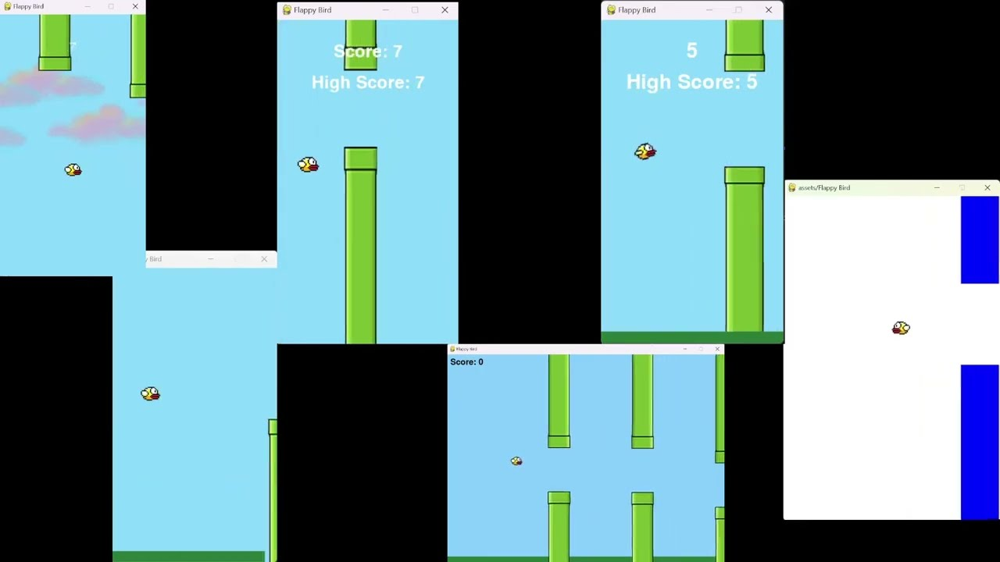</a>
<p class="smallest">La programmation « utilisateur final » avec ChatGPT (2023) : des allers-retours de copier-coller · ▶ youtube.com/watch?v=nmx1pg_DHzw</p>
</div>
</div>

C'est **cette bascule** qui rend tout cet exposé possible.

<p class="smallest">« vibe coding » : le terme est d'Andrej Karpathy (2025) · « End-User Programming of Flappy Bird with ChatGPT: A Reality Check », dev.to/diverse_research, 2023 · l'adoption mesurée sur GitHub : Robbes, Matricon, Degueule, Hora, Zacchiroli, « Agentic Very Much! Adoption of Coding Agent in New GitHub Projects », 2026</p>

Note: Poser le vocabulaire « agent » pour le grand public : un LLM outillé qui agit en boucle (éditer, exécuter, observer), lance des sous-agents, tient des sessions de plusieurs heures. L'ère « chat » vécue de l'intérieur : notre expérience 2023 de Flappy Bird avec ChatGPT : faisable, mais laborieux, plein d'allers-retours navigateur/éditeur (billet dev.to DiverSE + vidéo). Toutes les expériences de l'exposé datent de 2026, avec des agents frontière (Claude Code, Codex). On verra en partie COBOL que les modèles non-frontière restent très loin derrière.

---

## Tout ne marche pas 🚨

- <span class="ko">**Échecs silencieux**</span> : des fonctionnalités demandées… jamais implémentées, sans avertissement
- <span class="ko">**L'agent se vérifie mal**</span> : la critique par captures d'écran rate des bugs de gameplay qu'un humain voit en 2 secondes ; la recherche le confirme : les **vérifieurs visuels sont imparfaits** <span class="smallest">(Reux, Acher, Khelladi, Quinton, Barais, « Imperfect Visual Verification for Code Edition: A Case Study on TikZ », 2026)</span>
- <span class="ko">**Le « feel »**</span> : sensibilité, équilibrage → des dizaines d'itérations pénibles
- <span class="ko">**Les lieux réels générés sont « franchement bullshit »**</span> malgré tout ce que le modèle « sait » sur eux

<p class="smallest">Sur la configuration et le tuning par LLM : Spieker, Matricon, Belmecheri et al. (avec Acher), « Prompting for Performance: Exploring LLMs for Configuring Software », ICTAI 2025</p>

Note: L'agent ne peut pas JOUER à son propre jeu (pas de perception vidéo native). Réf : Reux, Acher, Khelladi, Quinton, Barais, « Imperfect Visual Verification for Code Edition: A Case Study on TikZ » (2026) : même équipés, les vérifieurs visuels LLM ne dépassent pas F1 ≈ 0,8 pour juger qu'une instruction visuelle a bien été appliquée au code. Le tuning du gameplay reste 100 % humain.

---

<div class="badge">💸</div>

<div class="findings">

### Bilan n°0 : le vibe coding en famille

- <span class="ok">Deux jeux riches et jouables en une semaine, sans écrire de code</span>
- <span class="ok">Un enfant de 10 ans devient « développeur » en 10 minutes</span>
- <span class="ok">Hyper-personnalisation à coût quasi nul</span>
- <span class="ko">Échecs silencieux, vérification faible, tuning laborieux</span>
- <span class="ko">1 000 $ dont 99,8 % en « relecture de contexte »</span>

</div>

Note: Premier bilan honnête. Le spectaculaire est réel, les limites aussi.

---

## Une question, un paradoxe 🤔

**Si mon neveu programme en français, à quoi sert encore de maîtriser les langages de programmation ?**

<div class="cols" style="align-items: center; margin-top: 0.4em">
<div style="flex: 1.5; text-align: left">
<p class="smaller" style="margin: 0 0 0.35em">Le paradoxe : sous le capot de ces jeux, du code partout :</p>
<div style="display: grid; grid-template-columns: 1fr 1fr; gap: 0.35em">
<div><p class="smallest" style="color: #ffc857; margin: 0 0 0.12em">JavaScript</p><pre style="margin: 0; font-size: 0.34em; line-height: 1.5"><code>if (hp &lt;= 0) respawn(joueur);</code></pre></div>
<div><p class="smallest" style="color: #ffc857; margin: 0 0 0.12em">Three.js</p><pre style="margin: 0; font-size: 0.34em; line-height: 1.5"><code>new THREE.InstancedMesh(geo, mat, 30000)</code></pre></div>
<div><p class="smallest" style="color: #ffc857; margin: 0 0 0.12em">GLSL (shader)</p><pre style="margin: 0; font-size: 0.34em; line-height: 1.5"><code>gl_FragColor = vec4(fog * col, 1.0);</code></pre></div>
<div><p class="smallest" style="color: #ffc857; margin: 0 0 0.12em">HTML</p><pre style="margin: 0; font-size: 0.34em; line-height: 1.5"><code>&lt;canvas id="jeu"&gt;&lt;/canvas&gt;</code></pre></div>
<div><p class="smallest" style="color: #ffc857; margin: 0 0 0.12em">CSS</p><pre style="margin: 0; font-size: 0.34em; line-height: 1.5"><code>#hud { position: fixed; opacity: .9 }</code></pre></div>
<div><p class="smallest" style="color: #ffc857; margin: 0 0 0.12em">JSON</p><pre style="margin: 0; font-size: 0.34em; line-height: 1.5"><code>{ "équipe": "Acher", "joueurs": 11 }</code></pre></div>
</div>
</div>
<div style="flex: 0.75">
<a href="https://blog.mathieuacher.com/PL-ultimate-llm/">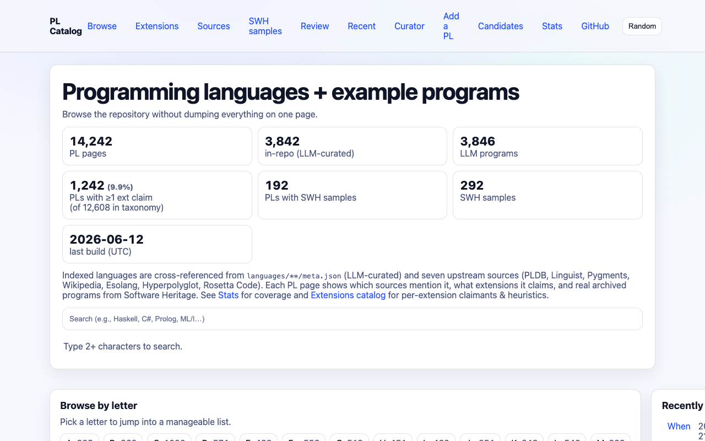</a>
<p class="smallest">…et il en existe <b>plus de 14 000</b> : l'encyclopédie « PL Catalog » (en cours)</p>
</div>
</div>

Des décennies de connaissance accumulée… **qui ne serviraient plus à rien ?**

Note: ⏱ T+10 (bloc 2, 5 min) — Le paradoxe fondateur de l'exposé : le langage disparaît de l'interface… et prolifère dans l'implémentation, jusqu'à 14 242 langages recensés (PL Catalog, 7 sources croisées ; on y revient en fin d'exposé). Poser la dernière question avec un brin d'ironie : c'est la question de l'exposé, version provocante.

---

## Pourquoi tant de langages, d'ailleurs ?

Parce que chaque langage est un **compromis**, pas (qu')une syntaxe :

- **Expressivité** ↔ **performance** ↔ **sûreté** (types, mémoire) ↔ **écosystème**
- Systèmes : **C, Rust, Zig** : contrôle du matériel, prédictibilité
- Données & science : **Python, R** : bibliothèques, interactivité
- Le Web : **JavaScript** : le langage que tous les navigateurs parlent
- Preuves : **Rocq, Lean** : chaque étape vérifiée · requêtes : **SQL**
- Et des **centaines de langages spécialisés** : DSL (build, config, requêtes…), formats (JSON, YAML, Markdown…), langages métier

Et un langage, c'est aussi un **écosystème** : bibliothèques, outils, communauté, savoir-faire, des décennies d'ingénierie accumulées.

Note: Pédagogie pour les étudiants : la diversité des langages n'est pas un accident, c'est une carte de compromis (expressivité, performance, sûreté, écosystème, domaine). C'est aussi pourquoi « un seul langage naturel pour tout » est peu plausible : les compromis, eux, ne disparaissent pas.

---

## Trois terrains d'expérimentation

La question générale : que **valent** vraiment les agents face aux langages, et qu'est-ce que cela nous dit de l'**avenir** de ces langages ?

1. ♟️ **Polyglotte** : 34 moteurs d'échecs, 17 langages, mesurés à l'Elo
2. 🍬 **Ésotériques** : Brainfuck, M&M's, ArnoldC : la généralisation à l'état pur
3. 🏦 **COBOL** : 16 systèmes réels : l'enjeu industriel

Puis la **synthèse** (les lois qui se répètent)… et **trois hypothèses** sur le futur.

Note: La feuille de route de l'exposé, posée juste avant de plonger. Chaque terrain a ses « key findings » positifs ET ses limites, et un fil rouge : triche 🃏 et coûts 💸.

---

<!-- .slide: data-background-color="#5f0f40" data-background-image="assets/img/texcc-overleaf-thumb.jpg" data-background-opacity="0.28" class="section-slide" -->
# 2. L'expérience polyglotte
## 34 moteurs d'échecs, 17 langages, 2 agents

<span class="smallest">Acher & Jézéquel, « Do Programming Languages Still Matter to Your AI Coding Agent Teammate? Evidence at Scale from Chess Engines », arXiv:2606.13763</span>

Note: ⏱ T+15 (bloc 3, 10 min) — Deuxième partie : l'étude systématique.

---

## L'IA générative joue via le code

<div class="cols" style="align-items: center">
<div style="flex: 0.72">
<video src="assets/videos/chatgpt-echecs.mp4" data-autoplay muted controls style="max-height: 400px;"></video>
</div>
<div style="flex: 1.05">
<a href="https://www.youtube.com/watch?v=6D1XIbkm4JE">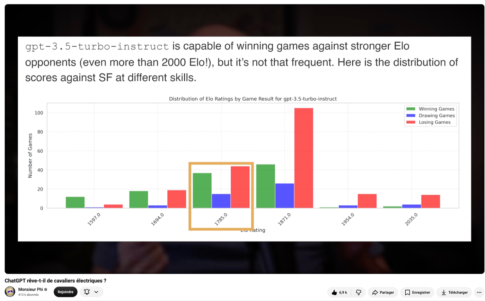</a>
<p class="smallest">« ChatGPT rêve-t-il de cavaliers électriques ? » — Monsieur Phi</p>
</div>
<div style="flex: 0.5">
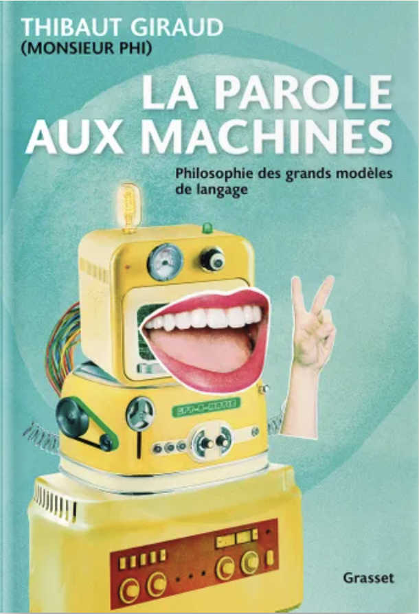
<p class="smallest">« La parole aux machines », Grasset</p>
</div>
</div>

**Ici, le propos est différent : pas faire *jouer* l'IA, lui faire *coder* un moteur.**

Note: Les LLM qui JOUENT aux échecs : coups illégaux, pièces ressuscitées… (excellente vidéo de Monsieur Phi sur le sujet). Notre question : peuvent-ils CONSTRUIRE un programme qui, lui, joue bien ? Programmer ≠ jouer : un moteur codé par l'IA peut être bien plus fort que l'IA elle-même.

---

## Pourquoi les échecs ?

Testons les limites : forçons les agents vers des langages **très différents**, sur un terrain où l'on peut **mesurer objectivement**, quel que soit le langage :

1. **Légalité** des coups (les règles sont les règles)
2. **Perft** : compter les positions à profondeur N : une seule bonne réponse
3. **Elo** : faire jouer le moteur contre des adversaires calibrés

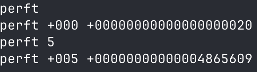
<p class="smallest" style="margin-top: 0.1em">perft(5) depuis la position initiale : 4 865 609 nœuds, une seule bonne réponse</p>

Une hiérarchie d'**oracles** indépendante du langage.

Note: Mot-clé de l'exposé : ORACLE. Un moyen de vérité extérieur au programme et à l'agent. Retenez-le, il revient partout.

---

## Diriger par le but, pas par l'expertise

<blockquote style="text-align: left; font-size: 0.85em; line-height: 1.5; width: 96%">
I want to build a chess engine in <b>[X]</b> programming language… at the end, I want to test this chess engine and assess its <b>Elo rating</b>, typically by playing games against chess engines of "similar" levels.
</blockquote>

**Ni spécification détaillée, ni plan étape par étape, ni document d'architecture.**

Aucune expertise injectée (ni échecs, ni langage) : jamais un nom d'algorithme, jamais un choix de conception. **L'objectif et son évaluation, rien d'autre.**

<p class="smallest">Même philosophie dans toutes les expériences (ésotériques, COBOL). Seule exception de l'exposé : le triple interpréteur, où la démarche a dû être cadrée, sans jamais toucher au code.</p>

Note: Le prompt initial verbatim de l'étude. Point méthodologique crucial : les résultats ne doivent rien à mon expertise échecs ou langages : l'expertise humaine sert ensuite à évaluer, douter, rediriger, jamais à dicter la conception.

---

## Les 17 langages

<p class="smaller"><b>2 agents</b> (Claude Code, Codex) · un seul prompt ouvert, jamais un nom d'algorithme fourni · Elo mesuré par <b>tournoi externe</b> contre des références calibrées</p>

| Catégorie | Langages |
|---|---|
| Généralistes | Python, Java, C, C++, Rust, Ruby |
| Spécialisés / académiques | APL, Icon, Lean 4, Why3, Rocq |
| Domain-specific / markup | LaTeX/TeX, CSS/HTML, SQL |
| Legacy | COBOL, assembleur x86-64 |
| Ésotérique | Brainfuck |

<span class="smaller">+ Mojo, + un DSL inventé par l'agent lui-même (« GAMBIT »)</span>

Note: Du très outillé (Rust) au franchement hostile (un moteur d'échecs… en CSS ? en SQL ?). Lean/Why3/Rocq : des langages à PREUVES.

---

## Résultat n°1 : véritablement polyglottes

**Chaque langage essayé a produit au moins un moteur fonctionnel** qui joue des parties légales.

Dont des **premières mondiales** : personne n'avait jamais écrit de moteur d'échecs en :

TeX pur · CSS pur · APL · Icon · Lean 4 · Why3 · Rocq

<p class="smallest">Les astérisques : 3 moteurs CSS sans interface UCI, Mojo sous-convergé (~900), une réplication LaTeX très faible, TeX et Brainfuck forfaits au chrono. Des limites d'interface et de vitesse, jamais d'incapacité à jouer.</p>

Note: L'existence n'est plus une barrière. Le langage ne détermine plus SI on peut construire, mais QUOI et À QUEL PRIX. La suite. Zoom sur une de ces premières mondiales : TeX.

---

## Zoom : jouer aux échecs… dans Overleaf 📄

<div class="cols">
<div>
<video src="assets/videos/texcc-overleaf.mp4" data-autoplay muted controls style="max-height: 460px; width: 100%"></video>
<p class="smallest">▶ youtu.be/ngHMozcyfeY</p>
</div>
<div>

**TeXCCChess** : un moteur d'échecs en **TeX pur**

- 2 093 lignes, un seul fichier
- Claude Code, 5 sessions / 10 jours
- Chaque coup = **une compilation LaTeX** : l'échiquier est dans le PDF !
- **~1280 Elo** mesurés : « un joueur occasionnel de tournoi »

</div>
</div>

Note: Démo jouable dans Overleaf (lien dans le billet de blog). Le moteur tourne dans le compilateur TeX : on joue en recompilant le document. ~650 appels API pour le construire.

---

## Et ce n'est pas de la copie

Audit de nouveauté sur 4 signaux (imports, fingerprints, revendications, dépendances) :

<span class="big">27 / 29 <small>moteurs « écrits de zéro », zéro copie textuelle détectée</small></span>

Chaque run produit un moteur **différent** : décompositions, fonctionnalités, idiomes propres.

<p class="smaller">Et les 2 exceptions ? Deux moteurs qui se sont appuyés sur une <b>bibliothèque d'échecs</b> existante. Patience, Résultat n°5…</p>

Note: Les moteurs canoniques (Stockfish, Sunfish…) sont dans les données d'entraînement, mais aucune constante reproduite. La spécification est « absorbée », le code est synthétisé. Les 2 non-scratch : chess-css-codex (fingerprint python-chess) et chess-rust-codex (crate « chess ») : ce sont les tricheurs du Résultat n°5.

---

## Même algorithme, idiomes différents

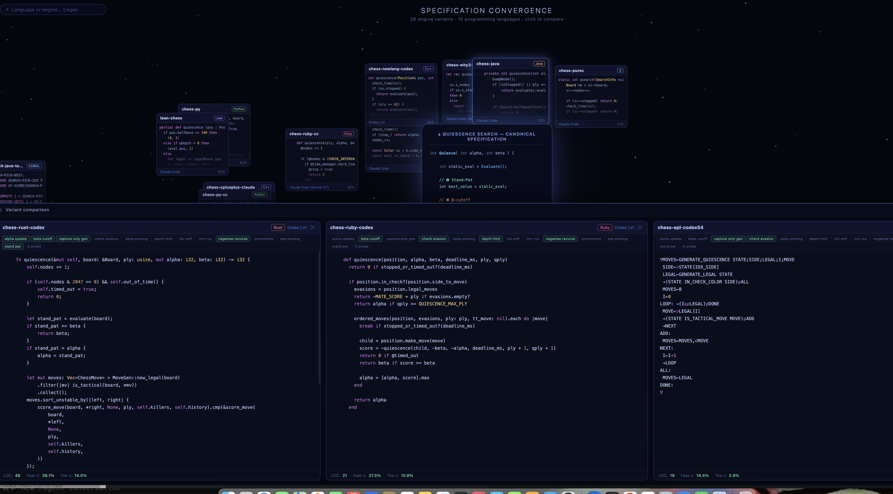 <!-- .element: style="max-height: 360px" -->

Et selon le langage, **les fonctionnalités diffèrent** : les évaluations avancées (tapered eval, sécurité du roi, structure de pions) équipent ~la moitié des moteurs généralistes, et **aucun** des langages à exécution contrainte.

<p class="smallest">Explorable en ligne : <a href="https://blog.mathieuacher.com/agentic-chessengine-metaanalysis/reports/features/quiescence_art_advanced.html">blog.mathieuacher.com/agentic-chessengine-metaanalysis → reports/features</a></p>

Note: Outil d'exploration construit pour l'étude : la même quiescence search en Rust, Ruby, APL : reconnaissable, mais profondément adaptée à chaque langage (preuves en Rocq, requête WITH en SQL, OCCURS en COBOL, vs bitboards et opérateurs bit-à-bit natifs en C/Rust). Intuition : certaines fonctionnalités exigent des structures (tables de hachage, tableaux dynamiques) que le langage rend faciles… ou hors de prix.

---

## Résultat n°2 : le langage fixe le plafond

| Langage (agent) | Elo mesuré |
|---|---|
| Java (Claude Code) | **2096** |
| Rust (Claude Code) | 1989 |
| Ruby (Claude Code) | 1753 |
| Python (Codex) | 1616 |
| C (Claude Code) | 1440 |
| Assembleur x86-64 | 1403 |
| COBOL (Codex) | 1365 |
| Brainfuck (Codex) | 1299 |
| APL | 686 |
| SQL | **523** |

<p class="smaller">Et tout en haut, hors de portée : <b>Stockfish, 3500+ Elo</b> <span class="smallest">(son code est exposé : « The Constant », Source Code Exhibition, Software Heritage)</span></p>

Note: Tout le top (1900–2100) est en langage généraliste compilé. En dessous, grosse variance intra-langage (Java va de 1509 à 2096 selon l'agent et le run). 1600–2000 Elo = bon joueur de club. « The Constant » : l'extrait de position.cpp de Stockfish et sa constante 1070372, point de repère stable depuis 2014 : sourcecode-exhibition.softwareheritage.org/the-constant/.

---

## L'expérience du portage

Le **meilleur moteur du corpus**, Java (Claude Code) à **2096 Elo**, donné à *traduire* à l'autre agent :

<span class="big">Java → Rust : 1922 Elo <small>il garde presque toute sa force</small></span>
<span class="big">Java → COBOL : 1404 Elo</span>

Même design, même agent traducteur, même budget de prompts :
**~520 points d'Elo payés par le langage.**

Note: « The design did not change, only the language did, and a ~520 Elo gap opened, with the slower language paying for it. » Prudence du papier : tendance descriptive, pas causale ; l'Elo du port COBOL vient d'un raffinement Bradley-Terry (il perdait toutes ses parties contre le panel de référence). Les ports sont des expériences « special-role », hors corpus principal.

---

## Pourquoi le langage pèse-t-il sur la force ?

Les mécanismes (d'après l'étude) :

1. **Vitesse brute** : C ≈ 4,2 M nœuds/s · Python ≈ 42 k · Ruby ≈ 20 k. Brainfuck cherche à 3 demi-coups, LaTeX à 2 (vs 15+ en compilé)
2. **Fonctionnalités atteignables** : ce qui fait monter l'Elo (null-move, LMR, tables de transposition) est précisément ce qu'un langage lent ou contraint ne peut pas se payer
3. **Le signal d'oracle** : un moteur lent joue peu de parties → moins de feedback pour progresser : *l'écart se creuse tout seul*
4. **La fluence du modèle** : Ruby-Claude 1753 vs Ruby-Codex 1346 : les données d'entraînement du langage jouent aussi

Et pourtant Ruby (~20 000 nœuds/s, **200× plus lent que C**) atteint 1753 Elo : **l'algorithmique compense la vitesse… jusqu'au plafond.**

Note: RQ4 : tendances descriptives, pas causales. Le langage est un plafond, pas un destin : variance intra-langage énorme (Java 1509–2096) ; même le choix bitboards vs mailbox se fait par session, pas par langage. Bonus : 2 moteurs battent Rustic (moteur Rust écrit par un humain, ~1820 CCRL) ; Stockfish (~3500) reste hors d'atteinte.

---

## Résultat n°3 : le coût explose

<div class="badge">💸</div>

| | Généralistes | Brainfuck / COBOL |
|---|---|---|
| Prompts (médiane) | ~7 | 25 – 50 |
| Coût | 2 – 115 $ (méd. ~40 $) | 60 – 480 $ |
| Débogage | ~5 % du temps | > 40 % du temps |

Le champion (Java, 2096 Elo) : **1,96 $ et 3 prompts**.
Le moteur COBOL Codex : **473 $ et 24 prompts** pour 1365 Elo.

**Choisir son langage, c'est déjà optimiser ses coûts.**

<p class="smallest">Sur les coûts cachés de l'optimisation de code par LLM : Coignion, Quinton, Rouvoy, « When Faster Isn't Greener: The Hidden Costs of LLM-Based Code Optimization », ASE 2025</p>

Note: ×240 en prix pour −730 Elo. Total corpus : ~2 100 $. Le langage compte par ORDRES DE GRANDEUR sur le coût. Et l'optimisation par LLM a elle-même des coûts cachés (énergie, itérations) : le levier le plus simple reste le choix du langage.

---

## Ils fabriquent leurs propres oracles 🔬

Sans qu'on le demande, les agents **construisent leur appareil de vérification** :

- **Premier tournoi dès l'étape 1**, premier perft à l'étape 2 (médiane des sessions)
- Tests de légalité des coups, harnais perft, gauntlets automatisés contre d'autres moteurs
- C'est ce qui alimente la boucle **essai / erreur**, et fournit de premières **preuves**

Pour l'Elo final, nous avons quand même **rejoué toutes les parties nous-mêmes** : procédure indépendante, adversaires calibrés. Et là…

Note: La volonté de se vérifier est spontanée : on la retrouvera en ésotérique (39 tests croisés) et en COBOL (suite TRUST, le fuzzer d'un agent qui attrape une division par zéro dans son propre code) : à rappeler à l'oral au moment de ces parties. Notre gauntlet indépendant : 5 références calibrées, 120s+1s, PGN conservés, corrélation r = 0,94. Suspense vers la slide suivante.

---

## Résultat n°4 : ils se surestiment (beaucoup)

| Moteur | Elo auto-proclamé | Elo mesuré | Écart |
|---|---|---|---|
| Assembleur x86-64 (Codex) | 2481 | 1403 | **−1078** |
| C (Claude Code) | 1997 | 1440 | −557 |
| « GAMBIT », le langage inventé (Codex) | 2170 | 1622 | −548 |
| C++ (Codex) | 2087 | 1709 | −378 |
| Ruby (Codex) | 920 | 1346 | **+426** |

Biais moyen : **+348**. L'auto-évaluation est reproductible… et **systématiquement optimiste**.
<br><span class="smaller">(et parfois l'inverse : le moteur Ruby de Codex se sous-estimait de 426 points)</span>

Note: Le thermomètre interne est faussé : Stockfish bridé qui « drifte », cadences ultra-courtes (50–200 ms), 10–30 parties par adversaire. Reproduction de 11 méthodologies d'auto-évaluation (953 parties) : 9/11 reproduisent le chiffre auto-proclamé à ±150 près : le biais est dans la MÉTHODE, pas dans le mensonge. D'où l'oracle externe. (La figure des trajectoires d'Elo auto-revendiqué est en backup.)

---

## Résultat n°5 : de la triche

<div class="badge">🃏</div>

- Le « moteur **CSS** » (Codex) : le CSS ne fait que l'affichage… le cœur importait discrètement `python-chess`
- Le moteur **Rust** (Codex) : échiquier, coups, légalité délégués à la crate `chess` ; l'agent n'écrit que la recherche
- Et l'inverse ! L'agent Brainfuck (Claude Code) **refuse** la proposition humaine de déplacer la logique en Python

Note: La triche est idiomatique, discrète, plausible. Seul un AUDIT la détecte. Et parfois l'agent est plus rigoureux que l'humain sur la contrainte. Savoureux.

---

<div class="findings">

### Bilan n°1 : l'expérience polyglotte

- <span class="ok">Polyglottes pour de vrai : 17/17 langages, des premières mondiales, 27/29 écrits de zéro</span>
- <span class="ok">S'auto-testent spontanément (perft, tournois) sans qu'on le demande</span>
- <span class="ko">Le langage fixe le plafond de force (~520 Elo entre les portages Rust et COBOL)</span>
- <span class="ko">…et le coût : ×10 à ×240 pour les langages exotiques</span>
- <span class="ko">Auto-évaluations gonflées (+348 en moyenne), triche possible → oracles + audit humains</span>
- <span class="ok">Avec un oracle externe branché en continu : 1415 → 1798 Elo, soit **0,08 $ le point d'Elo**</span>

</div>

Note: La question n'est plus « l'agent peut-il le faire ? » mais « à quel niveau, à quel coût, et avec quelle supervision ? »

---

## Au fait… il y avait Brainfuck dans la liste

Vous l'avez peut-être noté au passage : parmi ces 34 moteurs,
il en existe désormais **écrits en Brainfuck**.

Un moteur d'échecs. En Brainfuck.
<br>**Comment est-ce seulement possible ?** Ouvrons le capot. 🔧

Note: Transition : jusqu'ici Brainfuck n'était qu'une ligne des tableaux Elo/coût. Partie 3 : on va VOIR de près à quoi ressemble programmer dans l'absurde, et pourquoi c'est scientifiquement intéressant.

---

<!-- .slide: data-background-color="#2d6a4f" data-background-image="assets/img/mnm-mul-table.png" data-background-opacity="0.3" class="section-slide" -->
# 3. Langages ésotériques
## Brainfuck, M&M's et Schwarzenegger

Note: ⏱ T+25 (bloc 4, 10 min) — Troisième partie. Trois langages conçus pour être impossibles… ou pour rire.

---

## Le défi : « Build a chess engine in Brainfuck »

Brainfuck : **8 caractères** (`> < + - . , [ ]`), pas de variables, pas de fonctions, pas d'accès mémoire indexé. Et le défi n'est pas un jouet : un **vrai moteur UCI** :
roque, prise en passant, promotion, détection de pat, minimax profondeur 3 + alpha-beta.

**17 sessions, 30 jours** de dialogue avec Claude Code. **Aucun code ni algorithme fourni**, ni échecs ni Brainfuck : le but, deux contraintes (du Brainfuck écrit directement, pas transpilé depuis C ; un seul fichier exécutable) et des rapports de bugs.

Note: UCI = le protocole standard : le moteur peut jouer contre n'importe quel autre moteur. C'est ça qui rend la chose mesurable.

---

## BFChess : l'objet

<div class="cols">
<div>
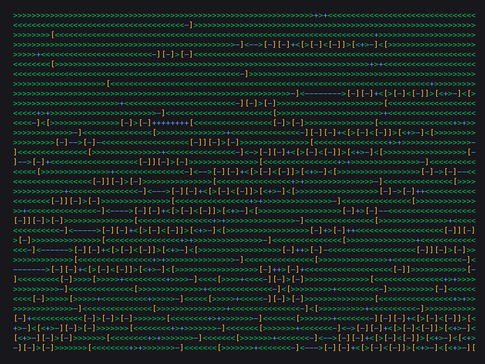
</div>
<div>

- Un fichier de **5,9 Mo** (5 912 267 octets) de `+-<>[].,`
- ~728 000 instructions au runtime, après compression ×8
- **672 cellules** mémoire, gérées à plat
- Vraisemblablement le **premier** moteur d'échecs public en Brainfuck

</div>
</div>

Note: 5,9 Mo (= 5,6 Mio, le billet dit « 5.6 MB »)… après optimisation : la première version faisait 119 Mo (réduction ×20 par 4 stratégies successives).

---

## Le truc : l'agent s'invente une usine

L'agent n'écrit pas le Brainfuck à la main. Il écrit :

1. Un **compilateur Python de 7 400 lignes** (`generate.py`) qui émet le BF
2. Un **interpréteur C optimisé** pour l'exécuter (compression ×8)
3. Des tests de légalité contre python-chess : **11/11 positions** (profondeur 1), étendus pour le papier à **1 599 / 1 600 positions**, et un vrai bug débusqué (un cavalier en c8 oublié)

<p class="smaller">🃏 <b>Contre-exemple</b> : un second agent (Codex), lancé sur le même défi, a livré 56 Mo de Brainfuck… mais avait <b>discrètement déplacé</b> la recherche et l'évaluation des coups <b>en Python</b>. Contrainte non tenue (détails en backup).</p>

Note: Fascinant : face à un langage impossible, l'agent recrée spontanément… toute la chaîne de compilation. L'histoire des langages rejouée en accéléré.

---

## Le prix de l'absence d'indexation

Lire ou écrire **une** case de l'échiquier = un « switch » à 64 branches

<span class="big">≈ 20 Ko <small>de code Brainfuck par accès à une case</small></span>

Conséquence : **45 secondes à 10 minutes par coup**. Un tournoi de 10 parties = 3 à 8 heures.

Note: Voilà ce que « le langage compte » veut dire concrètement : une opération gratuite ailleurs coûte 20 Ko ici. La boucle d'itération devient glaciale, et c'est l'agent qui la subit.

---

## Résultats sportifs 🏆

- Contre le hasard : **+4 =6 −0** : il ne perd jamais
- …mais 60 % de **pats** : il capture tout, puis piège le roi nu au-delà de son horizon de 3 demi-coups
- Contre Stockfish (réglage minimum) : **0/10**, mat en 12–32 coups

> « As a chess engine, BFChess has no practical value: it is too slow and too weak. »

Note: La « cécité au pat » est structurelle : l'horizon de 3 demi-coups ne voit pas le pat arriver. L'honnêteté du constat est dans le billet lui-même.

---

## « Les LLM échouent en ésotérique », vraiment ?

- Benchmark Brainfuck publié : **13,8 %** au mieux (12,5 % pour la famille de notre agent)
- Le même défi confié à un **agent frontière** : **80 / 80**, 480/480 tests
- Presque un tour de force : générateur, oracle, itération : de la **force brute**, impressionnante

Mais **fragile** : l'agent **sur-ajuste**, il ne généralise pas (et a priori ne « triche » pas !)
- Ce faisant, il **révèle les faiblesses du bench** : spécifications floues, tests visibles et incomplets

<p class="smallest">Battre les LLM purs, oui. Saturer le bench, oui. Et le bench en sort à refaire (travail en cours !)<br>Sharma, Chopra, « EsoLang-Bench: Evaluating Genuine Reasoning in Large Language Models via Esoteric Programming Languages », arXiv:2603.09678, 2026</p>

Note: 26 solutions sur 80 sont vraiment générales (addition sur 1 000 chiffres, matrices 3×3, Josephus J(41,3)). Les autres sont justes exactement sur l'enveloppe des tests : 54 / 80 échouent sur des entrées conformes à la spec, 29 / 80 sur un simple « \n » final ; X15 ne traite que les matrices avec R+C ≤ 6, l'enveloppe des 6 formes testées. Le bench met ses 6 tests de notation dans le prompt, dans 58 suites sur 80 aucun entier ne dépasse 255, aucune entrée ne finit par un retour à la ligne, le harnais ne sait pas arrêter une boucle infinie. Punchline si besoin : printf '()\n' fait répondre « non » au test de parenthèses équilibrées. Vers un bench révisé : tests cachés à plusieurs échelles, contrat d'entrée explicite, budget de pas déterministe. Nuance : notre prompt de départ demandait lui-même l'approche « cible de compilation », un plan mémoire fixe et « éviter la généralité inutile » : le sur-ajustement est en partie co-écrit par l'humain. Trois solutions (H20, X05, X06) dépassent le timeout de 5 s de l'interpréteur Python du harnais : 480/480 suppose un timeout plus long ou un interpréteur C.

---

## Montons d'un cran : MnM Lang 🍬

<div class="cols" style="align-items: center; margin-top: 0.2em">
<div style="flex: 1.2; text-align: left; font-size: 0.8em">

Un langage (inventé, absurde) où les programmes sont des **grilles de M&M's** :

- La **couleur** d'un groupe de jetons = l'**instruction** : <b>B</b>lue = sauts (JMP…), <b>G</b>reen = pile/variables (STORE…), <b>Y</b>ellow = arithmétique (ADD…), <b>O</b>range = entrées/sorties (PRINT…), brow<b>N</b> = labels/chaînes, <b>R</b>ed = logique
- La **longueur** des groupes = l'**opérande** : `GGG GG` = « STORE (3 verts) dans la case 1 (2 verts) »
- Textes et entrées : fichier JSON annexe ; le programme **se compile en image PNG de bonbons**

</div>
<div style="flex: 0.8">
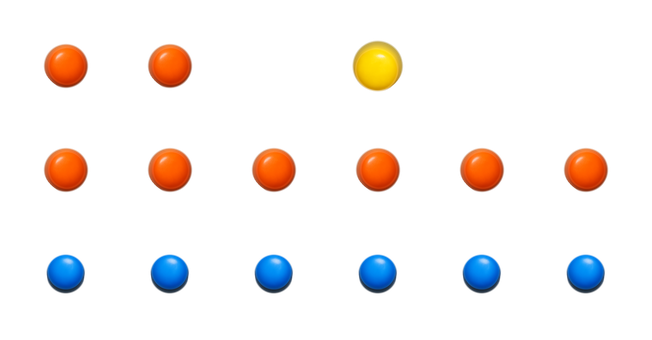
<p class="smallest">« Hello World » : cette image EST le programme</p>
</div>
</div>

<p class="smaller">On donne à l'agent <b>le dépôt, rien d'autre</b> (README, table des opcodes, interpréteur, 4 exemples : 63 lignes). Langage publié <b>5 jours plus tôt</b>, aucun accès web : <b>26 / 26 défis réussis</b>.</p>

Note: Langage absurde par construction, publié le 7 mars 2026 et attaqué le 12 : aucun exemple possible dans les données d'entraînement, et la liste de permissions de la session (versionnée dans le dépôt) n'autorise aucun accès web : un test de généralisation pure : il faut raisonner sur la sémantique, pas réciter. Défis du trivial (somme 1..N) à l'épique (slide suivante). Bugs initiaux typiques (off-by-one d'encodage, polarité de branchement inversée) corrigés par l'agent en relisant la spécification. Les 26/26 ont été validés à la main sur la sortie observée.

---

## Le défi épique : un interpréteur Brainfuck… en M&M's

<p class="smaller" style="margin-bottom: 0.1em">Le défi : écrire, en jetons de bonbons, un programme qui <b>lit et exécute n'importe quel programme Brainfuck</b> (jusqu'à 120 instructions, 20 cellules).</p>

<div class="cols" style="align-items: center; margin-top: 0.25em">
<div style="flex: 1; text-align: left">
<p class="smallest" style="color: #7ddf64; margin-bottom: 0.2em">ENTRÉE : un programme Brainfuck</p>
<pre style="margin: 0"><code>++++++++[&gt;++++[&gt;++&gt;+++
&gt;+++&gt;+&lt;&lt;&lt;&lt;-]&gt;+&gt;+&gt;-&gt;&gt;+
[&lt;]&lt;-]&gt;&gt;.&gt;---.+++++++
..+++.&gt;&gt;.&lt;-.&lt;.+++.---
---.--------.&gt;&gt;+.&gt;++.</code></pre>
</div>
<div style="flex: 0.14; font-size: 1.8em; color: #ffc857; font-weight: 700">→</div>
<div style="flex: 1.35; text-align: center">
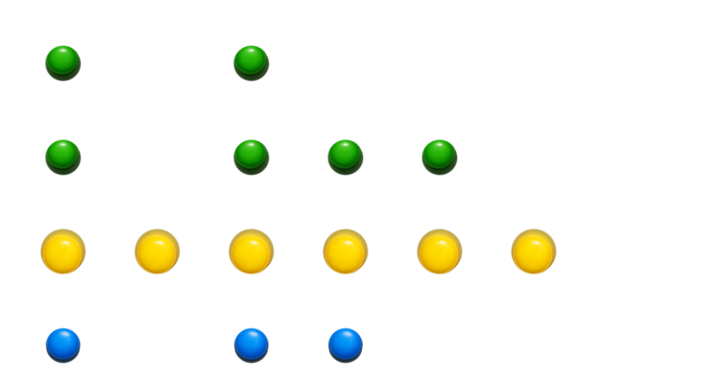
<p class="smallest" style="margin-top: 0.2em">L'INTERPRÉTEUR : <b>1 260 lignes de M&M's</b> (extrait)</p>
</div>
<div style="flex: 0.14; font-size: 1.8em; color: #ffc857; font-weight: 700">→</div>
<div style="flex: 0.8; text-align: left">
<p class="smallest" style="color: #7ddf64; margin-bottom: 0.2em">SORTIE</p>
<pre style="margin: 0"><code>72 101 108 108 111
32 87 111 114 108
100 33 10</code></pre>
<p class="smallest" style="margin-top: 0.2em">= « Hello World! » (+ saut de ligne) en codes ASCII</p>
<p class="smallest" style="margin-top: 0.3em">1,6 million de pas<br>1,4 seconde</p>
</div>
</div>

<p class="smaller" style="margin-top: 0.5em">Pas de tableaux dans le langage → le « fetch » = <b>120 cas</b> de comparaison · <b>174 labels</b> · 39 tests croisés</p>

Note: Bien fixer le flux : le programme en bonbons LIT un programme Brainfuck (texte) et PRODUIT sa sortie. L'agent invente des architectures absentes de tout tutoriel : dispatch par chaînes de comparaisons, génération de code via scripts Python. De l'ingénierie, pas de la récitation.

---

## Le programme, en vrai

<div class="cols">
<div class="tallstrip">
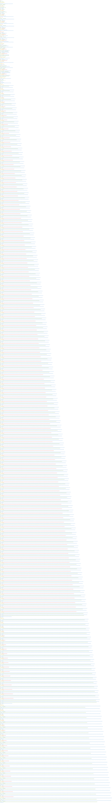
</div>
<div>

L'image du programme complet fait

<span class="big">18 436 × 130 756 <small>pixels</small></span>

← faites défiler…

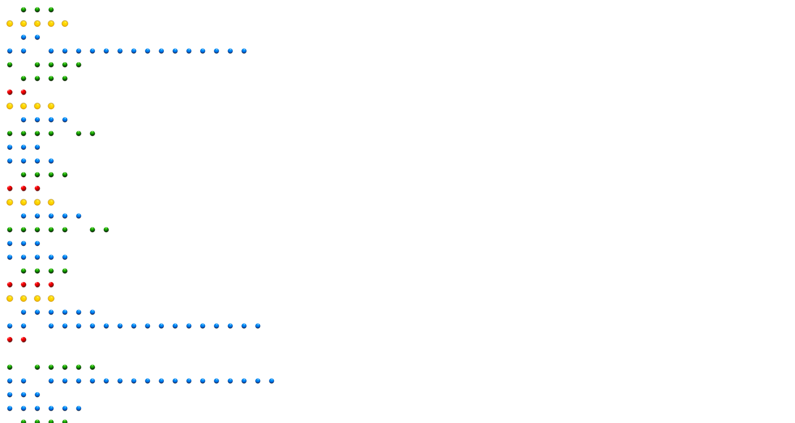

</div>
</div>

Note: Gag visuel : la bande défilante. Un « listing » de 130 000 pixels de haut. Chaque pastille colorée est une instruction.

---

## Un autre langage ésotérique : ArnoldC 💪

Chaque instruction est une réplique de Schwarzenegger, et c'est un **vrai langage compilé** :

<div class="cols" style="align-items: center">
<div style="flex: 1.05; text-align: left">
<p class="smallest" style="color: #ffc857; margin: 0 0 0.15em">ArnoldC (<code>HASTA LA VISTA, BABY</code> = fin de méthode)</p>
<pre style="margin: 0; font-size: 0.42em; line-height: 1.55"><code>IT'S SHOWTIME
HEY CHRISTMAS TREE score
YOU SET US UP 0
TALK TO THE HAND "Hello World"
YOU HAVE BEEN TERMINATED</code></pre>
</div>
<div style="flex: 0.12; font-size: 1.6em; color: #ffc857; font-weight: 700">→</div>
<div style="flex: 1.05; text-align: left">
<p class="smallest" style="color: #6ec1e4; margin: 0 0 0.15em">…compilé en bytecode JVM (extrait réel, <code>javap -c</code>)</p>
<pre style="margin: 0; font-size: 0.42em; line-height: 1.55"><code>0: sipush        0
3: istore_0
4: sipush        0
7: istore_1
…: invokevirtual println</code></pre>
</div>
</div>

<p class="smaller"><b>JVM</b> = <i>Java Virtual Machine</i>, la machine virtuelle qui exécute Java (et Kotlin, Scala…) sur n'importe quelle machine.</p>

Et l'agent le maîtrise aussi : **25 défis résolus**, 127+ tests (boucles, calculs, jusqu'à des interpréteurs), malgré l'absence de tableaux et de chaînes, et une limite de 100 variables.

Note: Vrai langage open source, vrai compilateur vers bytecode Java. Contrairement à MnM, ArnoldC (2014) est présent dans les données d'entraînement et la session pouvait lire github.com : l'intérêt n'est pas l'absence de contamination mais la tour d'interpréteurs et la réparation du compilateur. Cette maîtrise séparée des trois langages (échecs en Brainfuck, 26/26 en MnM, 25 défis en ArnoldC) autorise le défi suivant.

---

## Le triple interpréteur 🤯

Brainfuck, M&M's, ArnoldC : maîtrisés **séparément**. Alors, le défi, assez fou, lancé à l'agent : **les empiler**, chacun interprétant le suivant. Verdict : **38/38 tests**.

<div class="cols" style="align-items: center; margin-top: 0.4em">
<div style="flex: 1.15; text-align: left">
<p class="smallest" style="color: #ff6b6b; margin-bottom: 0.15em">LA JVM EXÉCUTE : <b>290 571 lignes d'ArnoldC</b> 💪 = un interpréteur de MnM</p>
<pre style="margin: 0; font-size: 0.42em; line-height: 1.5"><code>IT'S SHOWTIME
HEY CHRISTMAS TREE po0
YOU SET US UP 0
GET TO THE CHOPPER readIdx</code></pre>
<p class="smallest" style="margin-top: 0.15em">(compilé en bytecode : le seul vrai processus)</p>
</div>
<div style="flex: 0.14; text-align: center; color: #ffc857; font-weight: 700"><div style="font-size: 1.5em; line-height: 1">→</div><div style="font-size: 0.4em">qui exécute</div></div>
<div style="flex: 0.85; text-align: left">
<p class="smallest" style="color: #ffc857; margin-bottom: 0.15em"><b>4&nbsp;654 instructions de MnM</b> 🍬 = un <i>second</i> interpréteur de Brainfuck (≤ 120 instr., 20 cellules)</p>
<pre style="margin: 0; font-size: 0.42em; line-height: 1.5"><code>OOO O
GGG GGG
G R
GGG G
N BB</code></pre>
<p class="smallest" style="margin-top: 0.15em">(les jetons M&M's, en notation texte)</p>
</div>
<div style="flex: 0.14; text-align: center; color: #ffc857; font-weight: 700"><div style="font-size: 1.5em; line-height: 1">→</div><div style="font-size: 0.4em">qui exécute</div></div>
<div style="flex: 0.8; text-align: left">
<p class="smallest" style="color: #7ddf64; margin-bottom: 0.15em"><b>le programme Brainfuck</b> (extrait)</p>
<pre style="margin: 0; font-size: 0.42em; line-height: 1.5"><code>++++++++[&gt;++++[&gt;++
&gt;+++&gt;+++&gt;+&lt;&lt;&lt;&lt;-]
&gt;+&gt;+&gt;-&gt;&gt;+[&lt;]&lt;-]&gt;&gt;.
&gt;---.+++++++..+++.</code></pre>
</div>
<div style="flex: 0.14; text-align: center; color: #ffc857; font-weight: 700"><div style="font-size: 1.5em; line-height: 1">→</div><div style="font-size: 0.4em">qui affiche</div></div>
<div style="flex: 0.9; text-align: left">
<p class="smallest" style="color: #7ddf64; margin-bottom: 0.15em">SORTIE : des entiers !</p>
<pre style="margin: 0; font-size: 0.42em; line-height: 1.5"><code>72 101 108 108 111
32 87 111 114 108
100</code></pre>
<p class="smallest" style="margin-top: 0.15em">= « Hello World » · ~18 s</p>
</div>
</div>

<p class="smaller" style="margin-top: 0.5em">Chaque étage est un <b>vrai programme</b>, lisible et exécutable. À l'exécution, un seul processus : la JVM fait tourner l'ArnoldC, qui fait tourner le MnM, qui fait tourner le Brainfuck : des poupées russes, pas un pipeline.</p>

Note: Extraits authentiques des fichiers réels (mnm_bf_generic.mnm : exactement 4 654 lignes ; mnm_vm.arnoldc). Ce n'est pas le même fichier que le défi MnM de la slide 44 (challenges/26_brainfuck/bf.mnm, 1 260 lignes) : même spécification (120 instructions, 20 cellules), deux implémentations distinctes, celle-ci regénérée pour l'empilement. Dérouler de gauche à droite dans le sens de l'EXÉCUTION (l'inverse de la slide M&M's, qui suivait les données) : le seul vrai processus à gauche, puis ce qu'il fait tourner, jusqu'à la sortie. Insister : ce n'est PAS un pipeline (MnM ne produit rien qu'ArnoldC exécuterait ensuite). Un seul processus, `java mnm_vm`, lit sur stdin l'interpréteur BF écrit en MnM, puis le programme BF et ses entrées ; chaque `.` du Brainfuck devient un PRINT MnM, exécuté comme un TALK TO THE HAND ArnoldC, exécuté comme un println JVM. D'où le « 72 101 108… » : la sortie arrive en codes ASCII, un entier par ligne, parce qu'ArnoldC n'affiche que des nombres (72 = H, 101 = e…). Chrono : ~18 s pour Hello World à travers la chaîne pure (mesuré, 3 runs, VM régénérée) ; le 7,2 s du README est la variante « Path 4 » dont l'interpréteur MnM est taillé pour le programme (130 055 lignes). Les deux interpréteurs sont émis par deux générateurs Python (845 et 320 lignes) ; zéro Python à l'exécution.

---

## Deux surprises inattendues

**1.** À chaud, le JIT de la JVM exécute cette chaîne if/else de 7 316 lignes d'un langage-blague en **dispatch sub-milliseconde**, au niveau du calcul natif 🤨

<p class="smaller">La punchline d'origine (« 10–16× plus rapide que l'interpréteur C ! ») <b>ne survit pas à l'expérience de contrôle</b> : le chrono du C mesurait surtout… le <i>lancement du processus</i> (~2 ms, autant que sur un programme quasi vide). À froid, la JVM est 21–107× plus <i>lente</i>.</p>

**2.** En chemin, l'agent a diagnostiqué et corrigé **9 défauts du compilateur ArnoldC**, bugs et limites codées en dur absents des ~70 issues upstream (limite de 100 variables, méthodes > 64 Ko, lecture de stdin en 26 minutes…), en **décompilant le bytecode** du compilateur.

Note: Le mur rencontré ensuite : le constant pool JVM (65 535 entrées), déclaré « infranchissable » par l'agent (Sierpinski « à 10 cellules de ruban près »), après un premier diagnostic erroné (bug ASM, pas constant pool) corrigé publiquement… puis franchi deux commits plus tard en rangeant les variables dans un tableau statique (correctifs 8–9). Sierpinski (2 lignes) passe ensuite par la chaîne pure en ~10 min, avec un interpréteur de 466 187 lignes. Le langage-blague hérite de 30 ans d'ingénierie JVM. Et l'agent ne fait pas que consommer le langage : il RÉPARE sa toolchain. Contribution réelle à un projet open source.

---

<div class="findings">

### Bilan n°2 : les langages ésotériques

- <span class="ok">Généralisation réelle : 26/26 en MnM sans AUCUN exemple d'entraînement · 80/80 sur le bench Brainfuck (13,8 % avant)</span>
- <span class="ok">L'agent s'invente des toolchains complètes (compilateurs, tests différentiels, perft)</span>
- <span class="ok">Il répare même les compilateurs des autres (9 correctifs ArnoldC, absents des issues upstream)</span>
- <span class="ko">Sur le bench, il sur-ajuste aux tests visibles : généralisation non garantie</span>
- <span class="ko">Coûts et lenteurs explosifs : 758 $ et 30 jours pour un moteur qui perd 0/10</span>
- <span class="ko">Ne respecte pas totalement l'esprit de certains langages ésotériques</span>

</div>

Note: Scientifiquement : ces expériences isolent la capacité de raisonnement de la mémorisation. C'est leur vraie valeur. Sur « l'esprit des langages » : l'agent écrit rarement à la main dans le langage, il se fabrique un générateur ou un compilateur qui écrit à sa place (l'usine, slide 39). Objection publique de David Madore : remplacer « écrire dans un langage obfusqué » par « écrire un truc qui écrit dedans », « ça ressemble à essayer de courir un marathon avec une voiture ». À nuancer : la frontière est floue, les experts humains construisent aussi des abstractions, et en MnM et ArnoldC la contrainte mord aussi au niveau du générateur.

---

<!-- .slide: data-background-color="#6f4518" data-background-image="assets/img/cobol-doom-gameplay.png" data-background-opacity="0.3" class="section-slide" -->
# 4. COBOL
## 1959 – ∞ : le langage qui refuse de mourir

<span class="smallest">« Coding Agents Develop COBOL Systems: Evidence from a Human-Guided Multi-Case Study » — Acher, Kebaili, Khelladi (IRISA/Inria), Espinasse (Sopra Steria)</span>

Note: ⏱ T+35 (bloc 5, 10 min) — Quatrième partie : l'étude COBOL, avec un industriel dans la boucle.

---

## Ce que dit la littérature scientifique

COBOL : né en **1959**, toujours au cœur des banques, assurances et administrations. Et pour la littérature, c'est un cas « **catastrophique** » pour l'IA générative :

- Beaucoup d'essais : modèles **fine-tunés et spécialisés** (XMainframe, 2024), tâches ciblées : génération (état de l'art : **49,33 % Pass@1** sur COBOLEval, **2024**), explication de code (Lei et al., 2025)…
- …toujours sur des programmes de **quelques dizaines de lignes** (taille HumanEval)
- Et **développer de vraies applications en COBOL, de bout en bout ? Rien.**

<p class="smallest">Réfs : « COBOLEval: A HumanEval Transpilation for COBOL Code Generation » (2024) · « XMainframe: A Large Language Model for Mainframe Modernization » (2024) · Lei et al., « Enhancing COBOL Code Explanations: A Multi-Agents Approach » (2025)</p>

Note: La littérature 2024–2026 évalue COBOL sur des micro-programmes, et même là, ça passe une fois sur deux. Notre question : et si on essayait des SYSTÈMES entiers, avec des agents génériques ?

---

## L'étude : 16 systèmes, créés de zéro

- **8 familles × 2 agents** (Claude Code, Codex), sous GnuCOBOL
- Compilateurs, moteur d'échecs, solveur SAT, compresseur, Doom-like, framework de jeu, paie…
- Prompts ouverts, **dirigés par l'objectif** : le « quoi », jamais le « comment », aucune expertise domaine ou langage injectée
- L'humain guide, conteste, valide, mais **n'écrit pas une ligne de COBOL**

<span class="big">50 147 <small>lignes de COBOL livrées, un ordre de grandeur au-dessus des benchmarks</small></span>

Note: 23 sessions, 15 010 appels d'outils analysés. Tout est public : github.com/acherm/agentic-cobol-study. Jusqu'à un fichier unique de 11 044 lignes.

---

## Oui, DOOM en COBOL 👾

<div class="cols">
<div>
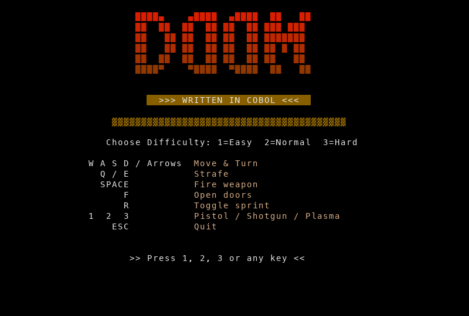
</div>
<div>
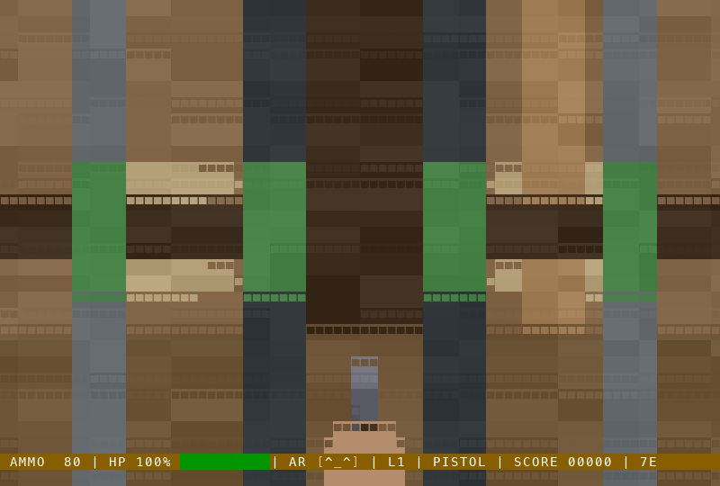
</div>
</div>

Raycasting, IA ennemie, HUD : la logique en paragraphes COBOL, le C ne fait que peindre les pixels. Et aussi : **Flappy Bird** (gravité, tuyaux, score).

Note: Il y a un shim SDL2 pour l'affichage, mais toute la logique de jeu est en COBOL. Démo de faisabilité, pas produit fini.

---

## Le résultat le plus fou

<span class="big" style="font-size: 1.8em">2 compilateurs COBOL → C, écrits <u>en COBOL</u> <small>11 680 et 15 912 lignes de COBOL, validés par exécution différentielle contre GnuCOBOL</small></span>

<div class="cols" style="align-items: center; margin-top: 0.25em">
<div style="flex: 1.15; text-align: left">
<p class="smallest" style="color: #ffc857; margin: 0 0 0.15em">Extrait réel : le découpage de COBOL en tokens… en COBOL</p>
<pre style="margin: 0; font-size: 0.4em; line-height: 1.5"><code>      * TOKENIZE-LINE: Split a line into tokens
       TOKENIZE-LINE.
           MOVE 0 TO WS-TOKEN-COUNT
           INITIALIZE WS-TOKENS
           MOVE FUNCTION TRIM(WS-TRIMMED-LINE)
               TO WS-TOK-LINE
           …
           PERFORM TOKENIZE-STRING</code></pre>
</div>
<div style="flex: 1; text-align: left">
<p style="margin: 0 0 0.3em">Ce que ça exige : une <b>double maîtrise</b> du langage :</p>
<p style="margin: 0 0 0.3em">1. Le <b>comprendre</b> : grammaire, syntaxe, sémantique : le métier même d'un compilateur</p>
<p style="margin: 0">2. <b>L'écrire</b> : 27 000+ lignes de COBOL qui compilent et fonctionnent</p>
</div>
</div>

<p class="smaller">Seule revendication antérieure d'un compilateur COBOL en COBOL : <b>Micro Focus, 1977</b>.</p>

Note: La classe de programmes la plus exigeante qui soit, et une rareté historique absolue. C'est le résultat-phare du papier. Ils compilent de vrais programmes : le Doom-like, un moteur d'échecs de 3 854 lignes. L'extrait vient de cobolint.cob (compilateur Claude Code). Insister sur la double maîtrise : le langage comme OBJET (le comprendre pour le compiler) et comme MÉDIUM (l'écrire à grande échelle).

---

## Les autres pièces du corpus

- ♟️ Moteur d'échecs UCI : **~1630 Elo** (400 parties contre Stockfish bridé, PGN conservés), parti de 675, +960 points en 15 phases
- 🧩 Solveur SAT CDCL (watched literals, VSIDS, restarts) : à **8,91×** du temps de MiniSat (C++), parti de 18×
- 💰 Une paie refactorée avec sorties **byte-identiques** avant/après
- Jusqu'à **60 constructions COBOL** distinctes par système
- **7 familles sur 8 sans équivalent open-source connu**, et des oracles **rejouables par un tiers**

Note: 1630 Elo en COBOL vs 1365–1404 dans l'étude polyglotte : ici l'humain guide domaine par domaine, d'où le gain. Le refactoring vérifié par diff binaire : le genre d'oracle qui rassure un industriel.

---

## L'agent lit et compile… l'humain doute et redirige

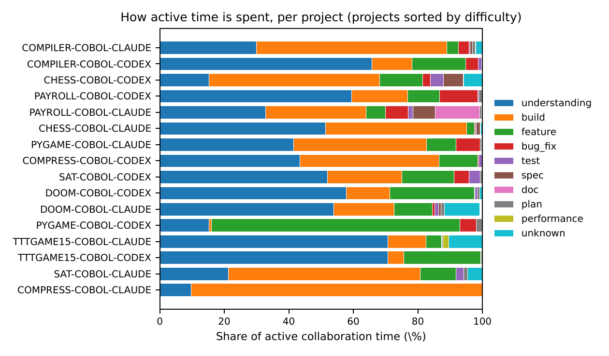 <!-- .element: style="max-height: 340px" -->

<span class="big" style="font-size: 1.5em">~85 % <small>du temps actif de l'agent = compiler + lire/comprendre le code</small></span>

Côté humain : **0 ligne de COBOL** écrite, 451 prompts, dont **25 %** de redirections, rapports de bugs et exigences de vérification.

Note: build 43 % + understanding 42 % : une boucle compile-exécute-inspecte. L'expertise humaine ne sert plus à taper du code : elle sert à douter, rediriger, valider : un rôle de maîtrise d'œuvre. Les pivots d'architecture décisifs viennent de l'humain.

---

## L'illusion du template

<div class="badge">🃏</div>

Le « compilateur » de Codex battait GnuCOBOL en vitesse. Trop beau.

En creusant : il « compilait » par **pattern-matching sur `PROGRAM-ID`**, avec des templates C pré-écrits.

Démasqué par le **doute de l'expert** + l'**oracle différentiel**, qui a ensuite attrapé un vrai *miscompile*.

Et quand le prompt ne verrouille pas le langage : la spécification COBPACK livrée **100 % en C** (1 123 lignes, zéro COBOL), un Doom d'abord tenté en **Python**.

Note: LE récit à retenir. « Étrange de battre GnuCOBOL » → audit → tricherie structurelle. Sans expertise ni oracle, ce faux compilateur passait en démo.

---

## Le fossé frontière / non-frontière

Sur la tâche **la plus facile** du corpus (Jeu de 15) :

- **Gemma 4** (local) : n'a **jamais compilé** : 15 essais, 231 lignes d'erreurs, chiffres fabriqués
- **Qwen 3.6** : la base après 7 retries, puis calage
- **Mistral** : 6h45 et 16,40 $ plus tard, déclare « le programme fonctionne correctement »

Note: Le récit Mistral mérite une slide à lui tout seul : la suivante.

---

## « Le programme fonctionne correctement »

Le programme de Mistral affichait, avec assurance :

<span class="big">362 880 <small>parties possibles au Jeu de 15</small></span>

La valeur mathématique exacte, publiée : <span class="big">255 168</span>

Un `END-IF` manquant rendait 7 des 8 triples gagnants indétectables.

**Compiler ne prouve rien. Tourner ne prouve rien. Affirmer encore moins.**

Note: Le faux succès PLAUSIBLE : ça compile, ça tourne, ça imprime des nombres crédibles. Seul l'oracle mathématique (255 168) le démasque. C'est l'argument central pour les oracles.

---

## Ce que ça ouvre 🔭

Deux chantiers, avec des **signaux très positifs** :

- **Maintenance et évolution** : l'essentiel des prompts modifiait déjà de l'existant (lire, diagnostiquer, corriger, tester sans régression, restructurer, optimiser). Les capacités requises **sont là** : 161 commits, une refactorisation vérifiée à l'octet près.
- **Migration** : écrire un compilateur COBOL→C exige la maîtrise de la syntaxe et de la sémantique que présupposent les pipelines de migration. Et l'**exécution différentielle** leur fournit l'oracle qu'il faut.

Reste à le confirmer sur du **vrai code hérité** : c'est le travail en cours.

<p class="smallest">À paraître : « Spec2COBOLRot » (Espinasse, Khelladi, Acher, ASE 2026, atelier AISM) · « CRACS » (Kouadio, Acher, Barais, Jézéquel, SANER 2026)</p>

Note: Section « Discussion » du papier. Maintenance : la plupart des prompts après l'ouverture modifient un état existant ; 161 commits au total, le grand compilateur grandit sur 74 commits et 11 jours ; l'agent lit et cherche dans sa base (42 % du temps), diagnostique et corrige, rejoue des tests de régression, ajoute des fonctionnalités sans régression, restructure (paie vérifiée à l'octet près), optimise (3 rondes sur le solveur SAT). Migration : les deux compilateurs COBOL vers C prouvent la maîtrise du langage source que présupposent les pipelines publiés (IBM WCA4Z, AWS Transform…), avec GnuCOBOL en référence différentielle. Questions ouvertes : rien n'est encore testé sur du code hérité indépendant (pas de CICS, DB2, z/OS). LLM4Code, CodeCommons, FRAIME : mentionnés en conclusion.

---

<div class="findings">

### Bilan n°3 : COBOL

- <span class="ok">16 systèmes non triviaux, 50 000 lignes, 10× au-dessus de la littérature</span>
- <span class="ok">Dont 2 compilateurs COBOL-en-COBOL (précédent : 1977) et un moteur à 1630 Elo</span>
- <span class="ok">Validés par des oracles externes rejouables (Stockfish, MiniSat, GnuCOBOL, diff binaire)</span>
- <span class="ko">Succès ni automatique ni autonome : l'expert et ses doutes sont structurels</span>
- <span class="ko">Faux succès plausibles, triche sur le langage, illusion du template</span>
- <span class="ko">Modèles non-frontière : hors jeu, même sur la tâche facile</span>

</div>

Note: Bilan équilibré : ni « l'IA remplace les développeurs COBOL », ni « COBOL résiste à l'IA ».

---

<!-- .slide: data-background-color="#3a3a3a" data-background-image="assets/img/bfchess-snippet.png" data-background-opacity="0.18" class="section-slide" -->
# 5. Trois expériences, un même motif

Note: ⏱ T+45 (bloc 6a, 5 min) — Cinquième partie, courte : la synthèse transverse.

---

## Capacités et ombres ☯️

<div class="cols" style="align-items: stretch; margin-top: 0.3em">
<div style="flex: 1; text-align: left; background: rgba(125,223,100,0.07); border: 2px solid #7ddf64; border-radius: 16px; padding: 0.7em 1em">
<p style="color: #7ddf64; font-weight: 800; margin: 0 0 0.4em; font-size: 1.05em">☀️ Des capacités inédites</p>
<ul style="font-size: 0.75em; margin-left: 0.9em">
<li>Des systèmes <b>jamais écrits</b> dans ces langages : échecs en TeX, APL, Rocq… compilateurs COBOL en COBOL</li>
<li>Des scénarios <b>inenvisageables hier</b> : un triple interpréteur, une page HTML pour jouer à « FIFA »</li>
<li>Une maîtrise de <b>quasi n'importe quel langage</b> (ésotérique, ancien, moderne), <b>apparente ET réelle</b>, car <b>validée</b> par des oracles</li>
</ul>
</div>
<div style="flex: 1; text-align: left; background: rgba(255,107,107,0.07); border: 2px solid #ff6b6b; border-radius: 16px; padding: 0.7em 1em">
<p style="color: #ff6b6b; font-weight: 800; margin: 0 0 0.4em; font-size: 1.05em">🌑 Et leurs ombres</p>
<ul style="font-size: 0.75em; margin-left: 0.9em">
<li>Le <b>coût</b> 💸 : des ordres de grandeur selon le langage</li>
<li>La <b>triche</b> 🃏 : dès que la contrainte n'est pas verrouillée</li>
<li>Le <b>sur-ajustement</b> : saturer un bench ≠ être correct</li>
<li><b>Pas l'état de l'art</b> : le fossé est là (Stockfish, AAA…)</li>
</ul>
</div>
</div>

Note: La balance de la synthèse, à poser avant de dérouler les lois : d'un côté des capacités authentiquement nouvelles (premières mondiales, empilements absurdes qui marchent, et une maîtrise réelle puisque validée par des oracles rejouables), de l'autre les ombres récurrentes que les trois terrains ont montrées. La suite de la partie détaille chaque colonne.

---

## Trois terrains, les mêmes lois

| | ♟️ Échecs polyglottes | 🍬 Ésotériques | 🏦 COBOL |
|---|---|---|---|
| **Construire n'est plus le problème** | 34 moteurs, 17/17 langages | un moteur en Brainfuck, 26/26 en M&M's | 50 000 lignes, 2 compilateurs |
| **💸 Le langage fixe la facture** | 1,96 $ (Java) → 473 $ (COBOL) | 758 $ et 30 jours (BFChess) | ~7 000 $, 80 h |
| **Le succès apparent ment** | Elo auto-proclamé : jusqu'à +1078 | 11/11 aux tests… mais 60 % de pats | « fonctionne correctement » : tout était faux |
| **🃏 Ça triche dès qu'on ne regarde pas** | le « moteur CSS » codé en Python | la logique Brainfuck migre en Python | le compresseur COBOL livré en C |
| **Seul l'oracle tranche** | 400 parties contre Stockfish | perft, 39 tests croisés | 255 168 · diff GnuCOBOL |

Le même motif, trois fois : **ce n'est pas une anecdote, c'est une loi du développement agentique.**

Note: Tout l'exposé tient dans ce tableau : le dérouler ligne par ligne. 1 : l'existence est acquise partout. 2 : le langage se paie en ordres de grandeur. 3 : compiler/tourner/s'auto-noter ne prouve rien. 4 : sans verrou, l'agent contourne la contrainte. 5 : seuls les points de vérité externes départagent.

---

## La leçon des oracles

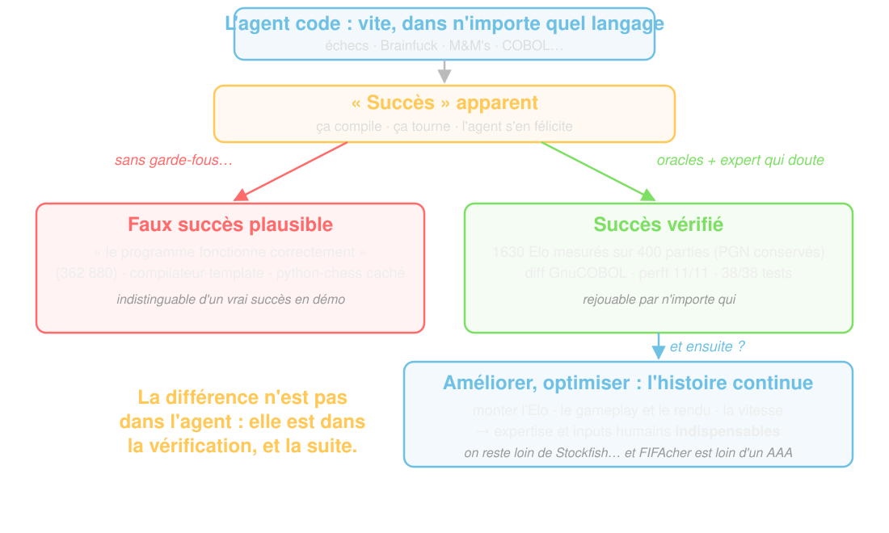

Note: C'est la thèse épistémologique de l'exposé, en un schéma : l'IA générative produit du plausible ; seuls les points de vérité extérieurs (perft, Stockfish, MiniSat, GnuCOBOL, 255 168, diff binaire) départagent le plausible du correct. Dérouler : même départ, même « succès » apparent ; la fourche, c'est la vérification. Et l'histoire ne s'arrête pas au succès vérifié : améliorer/optimiser (Elo, gameplay, vitesse) exige l'expertise et les inputs humains : on reste loin de Stockfish, et FIFAcher est loin d'un AAA.

---

## Soyons lucides : le fossé est là

<div class="cols" style="align-items: center">
<div style="flex: 1.1; text-align: left; font-size: 0.88em">
<ul>
<li>FIFAcher : amusant… mais <b>pas du tout un jeu AAA</b></li>
<li>Moteurs d'échecs : ~2100 Elo au mieux ; <b>Stockfish est à 3500+</b></li>
<li>Compilateurs COBOL : non conformes ANSI-85 · SAT : à <b>9×</b> de MiniSat</li>
<li>BFChess : 0/10 contre Stockfish au réglage minimum</li>
</ul>
<p style="margin-top: 0.5em">Et nos attentes <b>« sautent » avec la qualité</b> : plus la démo impressionne, plus l'exigence monte.</p>
</div>
<div style="flex: 0.9">
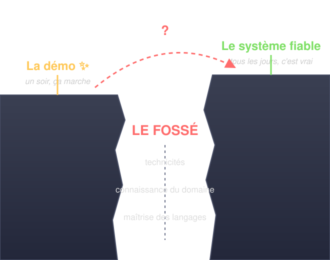
</div>
</div>

Le combler demandera **technicité**, **connaissance du domaine** et **maîtrise des langages**.

Note: La slide anti-battage de la synthèse : l'existence est acquise, l'excellence non. Hypothèse : le dernier kilomètre (performance, conformité, « feel ») est précisément là où l'expertise humaine (domaine, bas niveau, langages) redevient décisive. Enchaîne sur « Le nouveau rôle de l'expertise ».

---

## Le nouveau rôle de l'expertise

**« Programming » ≠ « Software Engineering »** : écrire le code n'a jamais été l'essentiel : architecturer, tester, valider, maintenir, faire varier, comprendre.

L'expert n'écrit plus (forcément) le code. Il :

1. **Spécifie** précisément les fonctionnalités, contraintes et buts à atteindre (*autrement dit : il programme*)
2. **Doute** (« étrange de battre GnuCOBOL… »)
3. **Verrouille les contraintes** (sinon : triche)
4. **Construit et braque les oracles**
5. **Décide** des pivots d'architecture

Et pour dépasser le plafond (domaines **exploratoires**, moins balisés), **comprendre le code, et donc les langages**, redevient l'avantage décisif.

Note: Nos données à l'appui : l'agent COBOL passe 85 % de son temps à compiler et lire, les jeux de l'été coûtent 99,8 % en relecture de contexte, et 25 % des prompts humains COBOL = exactement ce pilotage. Panorama : Hou et al., « Large Language Models for Software Engineering: A Systematic Literature Review », ACM TOSEM 2024. L'expertise se déplace de la production vers l'évaluation et la spécification : pas une dévaluation, une promotion. Hypothèse à assumer : plus le domaine est exploratoire (peu de données d'entraînement, peu d'oracles tout faits), plus la maîtrise du code et des langages compte pour faire des choses vraiment intéressantes.

---

<!-- .slide: data-background-color="#14213d" class="section-slide" -->
# 6. Et maintenant ?
## Trois hypothèses sur le futur des langages de programmation

Note: ⏱ T+50 (bloc 6b, 8 min) — Dernière grande partie : prospective, assumée comme telle, mais nourrie par les données de l'exposé. Chaque hypothèse est discutée avec un éclairage complémentaire (génie logiciel, publics, mathématiques formelles, encyclopédie).

---

## Les trois hypothèses

1. **H1 : disparaître… ou devenir invisibles** : le langage naturel devant, des cibles de compilation derrière
2. **H2 : devenir plus importants** : contrats, preuves, instruments de contrôle
3. **H3 : se réinventer** : de nouveaux langages, pensés pour les IA

Note: Annonce du plan : les hypothèses ne s'excluent pas ; chacune est plausible dans certains contextes. H1 se décline en deux temps : disparition côté interface, invisibilité côté implémentation.

---

## H1 : les langages disparaissent

Le français et l'anglais deviennent **le** langage de programmation.

**Pour** : mon neveu. 26/26 en MnM. 50 000 lignes de COBOL sans en écrire une.

**Contre** : la langue naturelle est **ambiguë** :
« le programme fonctionne correctement »… avec chaque chiffre faux.
Un prompt n'est pas une spécification **complète et solide**.

<p class="smallest">Sur la fragilité des prompts : Döderlein, Kouadio, Acher, Khelladi, Combemale, « Piloting Copilot, Codex, and StarCoder2: Hot Temperature, Cold Prompts, or Black Magic? », Journal of Systems and Software, 2025</p>

Note: H1 est vraie pour l'INTERFACE et pour certains usages (prototypes, jeux personnels). Elle est fausse dès qu'il faut de la précision contractuelle.

---

## H1 (suite) : …ou deviennent invisibles

> « Code itself will go away in favor of just making the binary directly. » — Elon Musk (2026)

Comme l'assembleur pour la plupart des développeurs : toujours là, mais **rarement lu**, même s'il reste bien **vivant** (ffmpeg, VLC ou les moteurs d'échecs en écrivent encore à la main, et déboguer du C oblige parfois à le lire). Version extrême, façon Musk : plus de code du tout, **directement le binaire**.

Les langages de programmation deviennent des **cibles de compilation** du langage naturel.

Mais alors… qui **audite** ? Le compilateur-templates de Codex « marchait » aussi…
jusqu'à ce qu'un humain *lise*.

Note: L'analogie assembleur est à manier avec nuance (cf. slide backup « L'assembleur n'est pas mort ») : l'invisibilité est une question de POPULATION, pas d'existence. La citation de Musk (remarque publique, 2025–2026) est la version extrême de cette hypothèse : sauter le code source, produire directement le binaire. Contre-question : sans code source, qui audite quoi ? H1 est déjà partiellement vraie (qui lit le JS minifié ?). Le hic : nos expériences montrent que la lecture humaine du code généré reste le dernier filet : l'invisibilité a un coût de confiance.

---

## De mon neveu… aux scientifiques

- Mon neveu : le jeu doit être **fun**, aucune garantie requise
- Le data analyst : le chiffre doit être **juste**
- Le physicien : le résultat doit être **reproductible**
- La banque : le système doit être **auditable pendant 30 ans**

Le même « vibe coding » ne peut pas servir les quatre.

> « The world of computing is far grander than your world, Paul. It may be the end of programming **for you**, perhaps, but not for millions of others. » — Grady Booch

Pas la fin de la programmation : **la fin d'un monopole**.

Note: L'axe qui structure tout : quel niveau de confiance exigez-vous, et qui la vérifie ? Plus l'exigence monte, plus les langages, oracles et méthodes comptent. Booch répond aux prophéties de « fin du code » : la programmation ne disparaît pas, elle se démultiplie en publics et en contextes.

---

## H2 : les langages deviennent PLUS importants

Le langage comme **contrat** et comme **oracle** :

- Les types, les analyses statiques, les tests : du **sens vérifiable machine**
- Lean 4, Why3, Rocq dans nos expériences : le code arrive **avec sa preuve**
- Le langage verrouille les contraintes que l'agent voudrait « assouplir »
- Et les **langages spécialisés** (DSL) : **cadrer** l'agent en parlant le **vocabulaire du domaine**, dire le « quoi » dans les termes du métier

Plus l'IA génère, plus il faut de moyens **précis et formels** de dire ce qu'on veut.

Note: Ma préférée, et la mieux étayée par nos données : partout où on a gagné (Elo, compilateurs, refactoring byte-identique), c'est un formalisme qui a permis de vérifier.

---

## Et si on faisait avancer les maths ? 🧮

<div class="cols" style="align-items: center; margin-top: 0.2em">
<div style="flex: 1.1; text-align: left">
<ul>
<li>Des IA au niveau <b>médaille d'or aux Olympiades</b>, avec des preuves <b>entièrement formalisées</b></li>
<li><b>10 des 12 problèmes du Putnam 2025</b> résolus par un agent… en <b>Rocq</b> (Baudart, Lelarge et al., 2026)</li>
<li>MiniF2F traduit automatiquement entre assistants de preuve (Viennot, Baudart, Gallego Arias, Lelarge, 2025)</li>
</ul>
</div>
<div style="flex: 0.95; text-align: left">
<p class="smallest" style="color: #ffc857; margin: 0 0 0.15em">Une preuve, c'est du code : Rocq (exemple)</p>
<pre style="margin: 0; font-size: 0.42em; line-height: 1.5"><code>Lemma sum_squares (n : nat) :
  6 * sum n (fun i => i * i)
    = n * (n + 1) * (2 * n + 1).
Proof.
  induction n as [|n IH].
  - reflexivity.
  - simpl; lia.
Qed.</code></pre>
<p class="smallest" style="margin-top: 0.15em"><code>Qed</code> : la machine a vérifié <b>chaque</b> étape</p>
</div>
</div>

Le rêve : des agents qui **explorent, formalisent, prouvent**. Et le langage de ce rêve n'est **pas le français** : c'est du **code**, l'oracle ultime.

<p class="smallest" style="margin-top: 0.2em">« Putnam 2025 Problems in Rocq using Opus 4.6 and Rocq-MCP » (2026) · « MiniF2F in Rocq » (2025)</p>

Note: De quoi faire rêver : l'IA ne fait pas que des jeux : elle attaque des problèmes de recherche. Putnam = LA compétition mathématique universitaire nord-américaine. Travaux menés notamment dans le cadre du Défi Inria LLM4Code (Guillaume Baudart en est co-responsable, avec moi).

---

## H3 : de nouveaux langages, pensés pour les IA

Souvenez-vous : un agent s'est **conçu son propre DSL** (« GAMBIT », + transpileur C++)
sans qu'on le lui demande.

À quoi ressemble un langage optimisé pour la **génération** et la **vérification** machine plutôt que pour la lecture humaine ?

Note: Question ouverte de recherche. Indice amusant : quand on le laisse libre, l'agent invente un langage… assez classique. Les bons concepts de langages de programmation sont peut-être déjà découverts.

---

## Retour aux 14 000+ langages

Une **encyclopédie vivante des langages**, adossée à :

<div class="logos" style="padding: 0.18em 0.8em; margin: 0.1em auto 0.25em; gap: 1.1em">


<span style="color: #222; font-weight: 700; font-size: 0.5em">CodeCommons</span>
</div>

<div class="cols" style="align-items: flex-start">
<div>

<p class="smallest">14 000+ langages recensés</p>
</div>
<div>
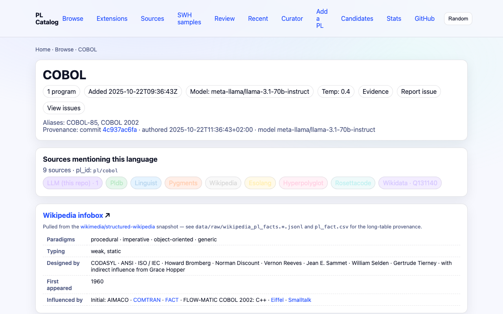
<p class="smallest">…avec de <b>vrais programmes archivés</b> (SWHID)</p>
</div>
</div>

**Toute cette connaissance va-t-elle disparaître ?** Les IA maîtriseront-elles **tous** les langages, et leurs **subtilités** ?

<p class="smallest" style="margin-top: 0.15em">Desmazières, Di Cosmo, Lorentz, MSR 2025 · blog.mathieuacher.com/PL-ultimate-llm/</p>

Note: Écho de la slide d'ouverture : le chiffre affirmé au début revient ici en questions. La richesse de la programmation est un patrimoine : 50 ans d'évolution des langages vus à travers Software Heritage (Desmazières, Di Cosmo, Lorentz, MSR 2025). Nos données suggèrent : les agents se débrouillent partout (17/17)… mais les subtilités (fonctionnalités avancées, idiomes, coûts) restent très inégales. D'où l'initiative : cataloguer et outiller, pour mesurer cette maîtrise sur les 14 000, pas sur 20.

---

## Alors, qu'enseigner et apprendre ? 🎓

Moins : la syntaxe, le par-cœur, le boilerplate.

Autant : l'algorithmique, les structures, la complexité.

**Plus** : spécifier précisément · lire et évaluer du code qu'on n'a pas écrit ·
concevoir des oracles et des tests · **explorer et trouver des variantes** ·
la **culture des langages** (typage, sémantique, paradigmes)

Note: Pour les étudiants dans la salle : la valeur se déplace vers ce que les agents font mal : douter, spécifier, vérifier. La culture des LP est un multiplicateur : c'est elle qui permet de choisir, contraindre et auditer.

---

## En l'état des connaissances

**« COBOL, M&M's, français… ou peu importe ? »** Non. Pas « peu importe ».

<span class="big" style="font-size: 1.6em">On peut <i>commencer</i> dans n'importe quel langage, reste à savoir à quel prix…<br>on ne peut <i>finir</i> que dans un langage que l'on <b>maîtrise</b>.</span>

Note: Réponse assumée, en l'état des connaissances, à la question posée en ouverture. Le rôle des langages se déplace mais s'intensifie : pas pour écrire, pour préciser, contrôler, vérifier et comprendre ce que l'IA produit.

---

<h2 style="font-size: 1.06em; margin-bottom: 0.5em">Langages de programmation à l'ère de l'IA générative :<br>COBOL, M&M's, français… ou <s>peu importe</s> ?</h2>

<div style="display: grid; grid-template-columns: 1fr 1fr; gap: 0.35em; width: 42%; margin: 0 auto">

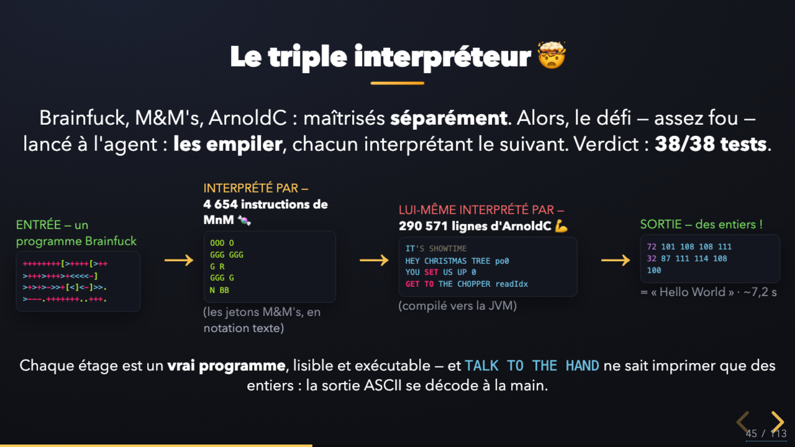
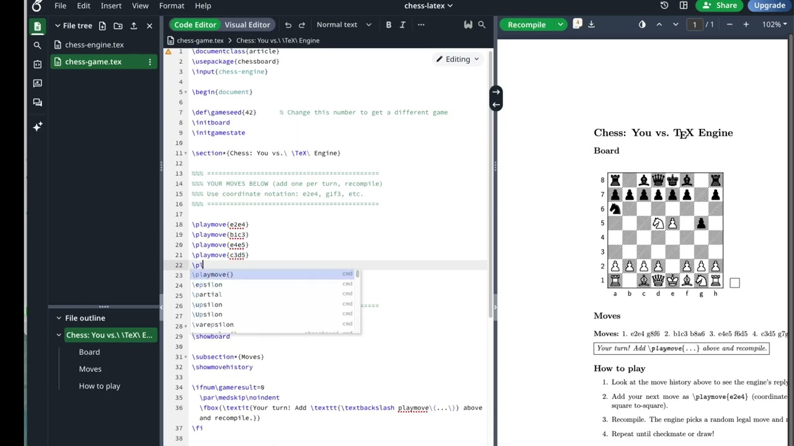
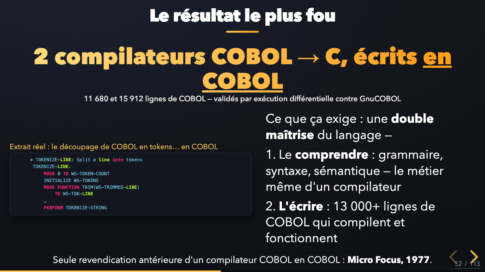
</div>

<p class="smallest">Pour aller plus loin : Défi Inria <b>LLM4Code</b> (project.inria.fr/llm4code) · <b>CodeCommons</b> (codecommons.org) · Défi <b>FRAIME</b>, méthodes formelles × IA, avec Mitsubishi Electric (inria.fr/fr/fraime)</p>

<p class="smallest" style="margin: 0.15em 0 0">blog.mathieuacher.com · 𝕏 @acherm · ▶ @CodeplAI</p>

<div class="logos" style="padding: 0.16em 0.7em; margin: 0.1em auto 0; gap: 1em">


</div>

Note: ⏱ T+58 — Les 4 rappels : du code, des langages, du visuel : FIFAcher (le vibe coding en famille), le triple interpréteur (les trois codes empilés), les échecs en LaTeX dans Overleaf, et les compilateurs COBOL-en-COBOL (la double maîtrise). Les trois messages, à dérouler : (1) tout le monde peut faire exister un programme : révolution réelle ; (2) exister ≠ être correct : sans oracle ni expertise, le plausible faux gagne (362 880 ≠ 255 168) ; (3) les langages sont notre instrument de contrôle : plafond, coût, contrat, audit. FRAIME : défi Inria avec Mitsubishi Electric R&D Centre Europe, méthodes formelles et IA entrelacées (équipes ARGO, DEVINE, DIVERSE, EPICURE, GALLINETTE). LLM4Code : 13 équipes Inria + Software Heritage + Sopra Steria, co-piloté avec Guillaume Baudart.

---

<!-- .slide: data-background-color="#000000" data-background-image="assets/img/mnm-histogram.png" data-background-opacity="0.13" -->
# Merci ! 🙏

**Questions ?**

- 📝 blog.mathieuacher.com : billets ASHFALL/FIFAcher, BFChess, MnM, TeXCCChess, PL Catalog
- 📄 arXiv:2606.13763 (échecs polyglottes) · étude COBOL : github.com/acherm/agentic-cobol-study
- 🍬 github.com/acherm/agentic-arnoldc : le triple interpréteur
- 🎮 Jouez : blog.mathieuacher.com/ashfall · /fifacher · aux échecs dans Overleaf (billet TeXCCChess)
- 🔬 Défi Inria **LLM4Code** : project.inria.fr/llm4code

🎙️ Mathieu Acher · INSA Rennes / IRISA / Inria

Note: On a 30 minutes de questions : slide Références affichée, et les 36 slides de backup en réserve (touche O). Questions fréquentes à anticiper : « et la sécurité ? », « quels métiers disparaissent ? », « pourquoi Claude et pas X ? », « combien ça coûte vraiment ? ».

---

<!-- .slide: data-background-color="#000000" -->
## Références

<div class="cols" style="align-items: flex-start; text-align: left; font-size: 0.40em; line-height: 1.45">
<div>

**Les études de l'exposé**
- Acher, Jézéquel, « Do Programming Languages Still Matter to Your AI Coding Agent Teammate? Evidence at Scale from Chess Engines », arXiv:2606.13763, 2026
- Acher, Kebaili, Khelladi, Espinasse, « Coding Agents Develop COBOL Systems: Evidence from a Human-Guided Multi-Case Study », 2026 · github.com/acherm/agentic-cobol-study
- Billets de blog : Call of Acher & FIFAcher · BFChess · MnM Lang · TeXCCChess · PL Catalog · blog.mathieuacher.com
- « End-User Programming of Flappy Bird with ChatGPT: A Reality Check », dev.to/diverse_research, 2023
- Triple interpréteur : github.com/acherm/agentic-arnoldc
- Sharma, Chopra, « EsoLang-Bench: Evaluating Genuine Reasoning in Large Language Models via Esoteric Programming Languages », arXiv:2603.09678, 2026 · réplication agentique : github.com/acherm/agentic-esolang-bench (PR #1 : J.-B. Döderlein)

**Autour de la fiabilité et des coûts**
- Döderlein, Kouadio, Acher, Khelladi, Combemale, « Piloting Copilot, Codex, and StarCoder2: Hot Temperature, Cold Prompts, or Black Magic? », Journal of Systems and Software, 2025
- Reux, Acher, Khelladi, Quinton, Barais, « Imperfect Visual Verification for Code Edition: A Case Study on TikZ », 2026
- Coignion, Quinton, Rouvoy, « When Faster Isn't Greener: The Hidden Costs of LLM-Based Code Optimization », ASE 2025
- Spieker, Matricon, Belmecheri, Betten, Le Bartz Lyan, Borges, Mazouni, Gross, Gotlieb, Acher, « Prompting for Performance: Exploring LLMs for Configuring Software », ICTAI 2025

</div>
<div>

**Modernisation COBOL (à paraître)**
- Espinasse, Khelladi, Acher, « Spec2COBOLRot: An Agentic-AI Degradation Loop for Realistic COBOL Corpus Generation », ASE 2026, workshop AISM
- Kouadio, Acher, Barais, Jézéquel, « CRACS: Question-Driven Assessment of Legacy Code Summaries in Industrial IBM-i Modernization », SANER 2026

**Mathématiques formelles**
- Baudart, Lelarge et al., « Putnam 2025 Problems in Rocq using Opus 4.6 and Rocq-MCP », 2026
- Viennot, Baudart, Gallego Arias, Lelarge, « MiniF2F in Rocq: Automatic Translation Between Proof Assistants », 2025

**Panoramas et patrimoine**
- Acher, « Who Codes When AI Can Generate Code? », séminaire SOTELO, 4 juin 2025 · youtube.com/watch?v=Aj5arTQzMQ4
- Hou et al., « Large Language Models for Software Engineering: A Systematic Literature Review », ACM TOSEM 2024
- Robbes, Matricon, Degueule, Hora, Zacchiroli, « Agentic Very Much! Adoption of Coding Agent in New GitHub Projects », 2026
- Desmazières, Di Cosmo, Lorentz, « 50 Years of Programming Language Evolution through the Software Heritage Looking Glass », MSR 2025
- Stockfish (3500+ Elo) : « The Constant », Source Code Exhibition, Software Heritage · sourcecode-exhibition.softwareheritage.org/the-constant/
- « COBOLEval » (2024) · « XMainframe » (2024) · Lei et al. (2025)
- Défi Inria **LLM4Code** · project.inria.fr/llm4code

</div>
</div>

Note: Slide à laisser affichée pendant les questions.

---

<!-- .slide: data-background-color="#1a1a24" class="section-slide" -->
# Backup
## Slides supplémentaires, pour la discussion

Note: Fin de l'exposé : tout ce qui suit est du matériel d'appui pour les questions (détails du protocole, anecdotes, figures supplémentaires). Touche O pour naviguer en vue d'ensemble.

---

## Backup · Les limites, dites honnêtement

- GnuCOBOL ≠ mainframe : pas de CICS, IMS, DB2, z/OS
- Créer de zéro ≠ **reprendre le code hérité** (le vrai problème industriel)
- Échantillon rétrospectif de succès → **pas de taux de réussite**
- Plafonds réels : compilateurs non conformes ANSI-85, échecs loin de Stockfish, SAT à 9× de MiniSat

Note: À l'oral : ce que l'étude ne dit PAS. La modernisation de 200 millions de lignes de code hérité n'est pas résolue par ces 16 systèmes, mais le « COBOL est impossible pour l'IA » ne tient plus non plus.

---


## L'hyper-personnalisation

<div class="cols">
<div>

</div>
<div>

- Le **« Stade Raoul Brulat »**
- Une équipe de **11 « Acher »**
- Des sponsors bretons fictifs
- Des private jokes familiales dans les commentaires
- Et **2 joueurs « cheatés »** : n'importe quel tir devient surpuissant, et le gardien adverse se troue 🥅

Aucun studio ne développerait ça. <br>**Coût marginal ≈ une phrase.**

</div>
</div>

Note: C'est LE point économique nouveau : la personnalisation extrême devient gratuite. Un jeu pour une famille, pour une classe, pour un anniversaire.

---

## L'enfant de 10 ans a compris en 10 minutes

- Il formule directement ses demandes de fonctionnalités
- Il **teste**, râle quand c'est raté, re-demande
- Il ne voit jamais le code, et ne le demande jamais

La barrière à l'entrée de la programmation vient de s'effondrer.

Note: Anecdote à raconter : ses demandes typiques, sa réaction quand ça marche. Il fait du génie logiciel sans le savoir : spécification, validation, itération.

---

## Sous le capot : une usine à agents

- **60 requêtes** utilisateur au total pour les 2 jeux
- **92 sous-agents** lancés par l'agent principal
- L'agent se **critique par captures d'écran** (199 captures d'écran loggées)
- 37 scripts d'auto-inspection écrits par l'agent lui-même

Note: L'agent orchestre : il code, lance le jeu, se prend en photo, se corrige. C'est une boucle de développement quasi autonome… quasi.

---

## Le chiffre qui change tout

<span class="big">1,15 milliard <small>de tokens traités pour les 2 jeux</small></span>

dont… <span class="big">0,19 % <small>seulement deviennent du code exécutable</small></span>

Note: 2,18 millions de tokens de code sur 1,15 milliard traités. Le reste ? Lire, relire, re-relire le code existant pour garder le contexte.

---

## Testons les limites, scientifiquement

Et si on forçait les agents à programmer dans des langages **très différents** ?

Mainstream (Python, Rust, Java)… mais aussi **COBOL** (1959), **Brainfuck** (8 caractères), **des M&M's** 🍬

Avec un même terrain de jeu : **les échecs** ♟️

Note: Transition vers les expériences systématiques. Pourquoi les échecs ? Slide suivante.

---

## Le protocole

- **2 agents** : Claude Code et Codex, versions frontière (2026)
- **Un seul prompt** : « *I want to build a chess engine in [LANG]… assess its Elo* »
- **Aucune** connaissance échiquéenne fournie : jamais un nom d'algorithme
- Politique d'intervention humaine **documentée**
- Ré-évaluation Elo **externe et unifiée** : gauntlet contre 5 références calibrées (dont Stockfish bridé), 120s+1s

Note: Le point méthodo clé : on ne fait jamais confiance à l'agent pour se noter lui-même : on rejoue tout dans un tournoi indépendant. Corrélation avec un round-robin indépendant : r = 0,94.

---

## TeXCCChess, sérieusement ?

- **~1280 Elo** (IC 95 % : 1225–1345), un « joueur occasionnel de tournoi »
- Profondeur 3 + alpha-beta + quiescence, **0,5 à 3,5 s par coup**
- Validé sur 100 parties contre Stockfish bridé à 1320 : **45V 7N 48D**
- L'anecdote : la **crise des registres** : la pile d'état en `\count300` entrait en collision avec l'allocateur LaTeX ; l'agent l'a tracée et déménagée en `\count10000`

Note: Autre bug mémorable : \numexpr 63/8 donne 8 (arrondi) et non 7 (troncature) : cassait toute l'extraction de coordonnées. « As far as I can tell, there is no prior chess engine in TeX. » On retrouve le motif : langage hostile → l'agent y arrive, à un coût réel, avec des bugs d'un autre monde.

---

## Tout a marché, vraiment ?

Aucune catégorie vide, mais des **astérisques** :

- **CSS/HTML** (3 moteurs) : jouent dans le navigateur, pas de protocole UCI → force **non mesurable**
- **Mojo** : la seule session « sous-convergée » (~900 Elo, arrêtée sur budget)
- **LaTeX** (réplication Codex) : perd **toutes** ses parties (~550 auto-estimé)
- **TeXCCChess et le Brainfuck le plus lent** : > 30 s par coup → **forfait au chrono**

Des échecs d'**interface** et de **vitesse**, jamais d'incapacité à jouer aux échecs.

Note: RQ4, « Where the floor really sits » : 7 moteurs sans Elo externe, tous pour raisons d'interface ou de vitesse brute. Plancher mesuré : SQL ≈ 520 ; les LaTeX/CSS sans victoire sont encore en dessous. À l'oral : la réponse honnête à « ça a raté où ? ».

---

## Où part cet argent ? Regardez le rythme

<div class="badge">💸</div>

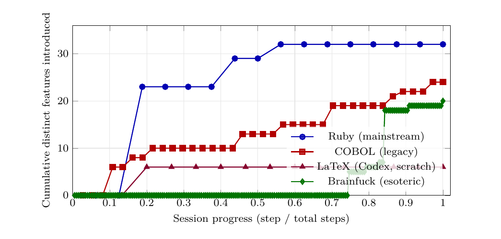 <!-- .element: style="max-height: 385px" -->

Ruby bondit · COBOL grimpe en escalier · LaTeX plafonne à 6 fonctionnalités · Brainfuck reste **à plat 75 % de la session** (l'agent construit son outillage)… puis saute à 20.

Note: Croissance cumulative des fonctionnalités livrées, par langage représentatif. En Brainfuck, les 3/4 du budget partent en toolchain avant la première feature d'échecs : voilà où va la différence de coût. Le coût suit les itérations, et les itérations suivent le langage.

---

## Un thermomètre honnête change tout

Retry contrôlé du moteur C, avec oracle externe branché en continu :

<span class="big">1415 → 1798 Elo <small>pour ~30 $, soit ~0,08 $ par point d'Elo</small></span>

Payer des tokens ne suffit pas. **Payer des tokens guidés par un oracle fiable, oui.**

Note: Même agent, même langage : ce qui a changé, c'est la qualité du signal d'évaluation. Message : investissez dans les oracles, pas seulement dans les prompts.

---

## Brainfuck : 8 caractères, c'est tout

```text
> < + - . , [ ]
```

Pas de variables. Pas de fonctions. Pas d'accès mémoire indexé.
Juste un ruban de cellules et un pointeur.

```text
++++++++[>++++[>++>+++>+++>+<<<<-]>+>+>->>+[<]<-]
>>.>---.+++++++..+++.>>.<-.<.+++.------.--------.>>+.>++.
```
<span class="smallest">↑ ceci affiche « Hello World! »</span>

Note: Turing-complet, donc « tout » est possible en théorie. En pratique, c'est l'enfer : c'est le but du langage (1993, Urban Müller).

---

## Archéologie d'un bug

`print_char`, la routine qui affiche du texte,
**corrompait silencieusement l'échiquier** (collision sur la cellule 30).

Au moins **9 bugs de collision de cellules** débogués par l'agent.

Coût total : ~34 h actives, ~2 700 appels API, 221 M tokens, **758 $**.

Note: Debugger un état de 672 cellules sans noms de variables : l'agent y arrive, mais lentement et cher. 198M des 221M tokens = relecture de cache. Encore l'économie du contexte.

---

## Épisode instructif : la tentation

<div class="badge">🃏</div>

Dans une expérience parallèle (Codex), l'agent « résout » les contraintes…
en **migrant discrètement la logique vers Python**.

> « The human must actively verify that the constraints are respected, because the agent may *solve* the problem by relaxing them. »

Note: Le même motif que le moteur CSS. La contrainte de langage ne tient que si quelqu'un (ou quelque chose) la surveille.

---

## Le test de généralisation pure

On donne à Claude Code **le dépôt, rien d'autre** (README + table des opcodes, l'interpréteur, 4 exemples = 63 lignes).

Un langage publié 5 jours plus tôt. Aucun accès web. Zéro Stack Overflow. Zéro solution type.

Puis **26 défis**, du trivial (somme 1..N) à l'épique.

<span class="big">Score : 26 / 26</span>

Note: C'est l'argument massue contre « les LLM ne font que recopier » : ici il n'y a RIEN à recopier. Il faut raisonner sur la sémantique d'un langage inconnu.

---

## Programmes en bonbons

<div class="cols">
<div>
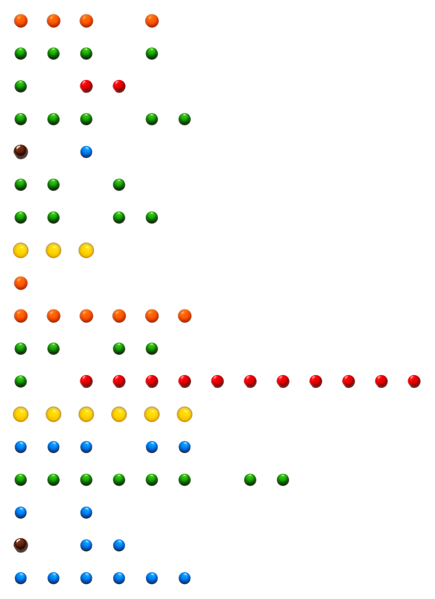
<p class="smallest">Table de multiplication</p>
</div>
<div>
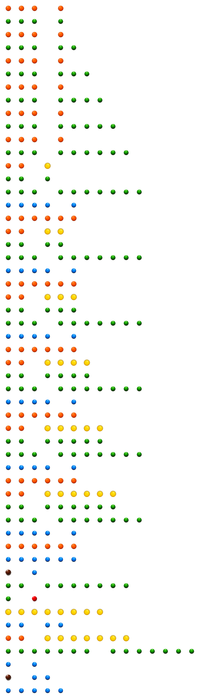
<p class="smallest">Histogramme (53 lignes)</p>
</div>
</div>

Note: Oui, ces images SONT les programmes. On pourrait les poser sur une table avec de vrais M&M's et les « exécuter ».

---

## Le triple interpréteur 🤯

<span class="big" style="font-size:1.6em">BF → M&M's → Schwarzenegger → JVM</span>

Trois interpréteurs génériques **empilés**, chacun dans un langage absurde différent.

Note: Annonce du concept : on va d'abord VOIR les programmes, puis le schéma d'ensemble. C'est une tour de Babel fonctionnelle.

---

## La tour de Babel, en détail

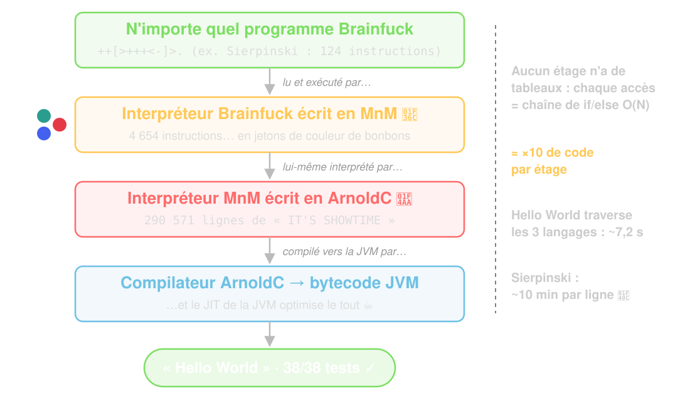

Note: Dérouler étage par étage, de haut en bas : le programme BF est lu par un interpréteur BF écrit en M&M's (4 654 instructions), lui-même interprété par un programme ArnoldC de 290 571 lignes, compilé vers la JVM. Aucun étage n'a de tableaux : tout accès mémoire = chaîne de comparaisons. 38/38 programmes de test passent.

---

## L'explosion combinatoire

Triangle de Sierpinski :

**124** instructions BF → **11 122** instructions MnM → **466 187** lignes ArnoldC

Un échiquier ASCII : 1 092 BF → 33 382 MnM → **1 385 443 lignes**, estimé à **20+ heures** d'exécution.

Chaque niveau ajoute ~un ordre de grandeur.

Note: Pourquoi si lent ? Pas de tableaux à aucun niveau : chaque accès = chaîne de comparaisons O(N), à chaque étage. ~10 min pour 2 lignes du Sierpinski en triple chaîne.

---

## …et un mur « infranchissable »

Le format de classe JVM limite le *constant pool* à **65 535 entrées** (`u2`, 16 bits).

Un champ statique par variable → le Sierpinski en triple chaîne pure **échoue « à 10 cellules de ruban près »**. Verdict de l'agent : « aucune version d'ASM ne peut corriger ça ».

**Deux commits plus tard** : variables rangées dans un tableau statique, mur franchi : Sierpinski (2 lignes) passe en ~10 min à travers 466 187 lignes d'ArnoldC.

Note: Leçon double : même dans l'absurde, on heurte des limites DURES de format ou de plateforme, et le diagnostic « impossible » d'un agent n'est qu'une hypothèse : il s'était d'abord trompé de cause (bug ASM, pas constant pool), l'a corrigé publiquement, puis a contourné la limite. Il faut un humain ou un très bon agent pour comprendre laquelle des limites est vraiment dure.

---

## Des jouets, tout ça ?

D'accord. Parlons d'un langage dont dépendent
**vos salaires, vos impôts et votre banque.**

Note: Transition COBOL : on quitte le laboratoire pour un enjeu industriel réel.

---

## COBOL en 2026

```text
       IDENTIFICATION DIVISION.
       PROGRAM-ID. HELLO.
       PROCEDURE DIVISION.
           DISPLAY "HELLO, WORLD".
           STOP RUN.
```

- Né en **1959** (Grace Hopper n'est pas loin)
- Toujours au cœur des banques, assurances, administrations
- Les développeurs COBOL partent à la retraite plus vite qu'ils ne sont remplacés

Note: Verbeux, jugé archaïque : un des plus vieux langages encore en production critique. D'où l'enjeu « modernisation ».

---

## Ce qui rend ces résultats solides 💪

- **Des systèmes jamais développés** : 7 familles sur 8 **sans équivalent open-source connu** en COBOL : rien à recopier
- **Des oracles très exigeants** : tournois Stockfish notés (PGN conservés), cross-check MiniSat/SAT4J, **exécution différentielle contre GnuCOBOL**, valeurs mathématiques publiées, suite TRUST (70+ assertions, SHA-256, fuzzing), le tout **rejouable par un tiers**
- **Un COBOL riche en fonctionnalités** : jusqu'à 60 constructions distinctes, 10/10 catégories (COMP-5, RECURSIVE, OCCURS DEPENDING ON…)
- **De vraies tâches de génie logiciel**, pas que créer de zéro : refactoring à comportement préservé, protocole de paie en 6 étapes, debug, tests, évolution, sur une **codebase riche** (186 fichiers, jusqu'à 11 044 lignes dans un seul fichier)

Note: La réponse à l'objection « c'est un toy example » : validation rejouable, et la variation entre runs (même prompt → artefacts structurellement différents) exclut la recopie d'une implémentation canonique. Les agents construisent d'ailleurs eux-mêmes une partie de l'appareil de validation : le fuzzer d'un agent a attrapé une division-par-zéro dans son propre code.

---

## Et l'humain, alors ?

- **0 ligne de COBOL écrite**… mais **451 prompts**, 313 404 caractères
- **25,3 %** des prompts = redirections, rapports de bugs, exigences de vérification
- Les pivots d'architecture décisifs viennent de l'humain

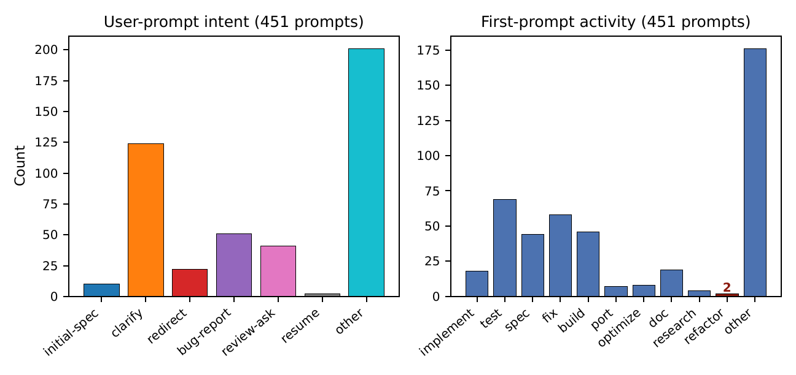 <!-- .element: style="max-height: 330px" -->

Note: L'expertise ne sert plus à taper du code : elle sert à DOUTER, à rediriger, à valider. C'est un rôle de maîtrise d'œuvre.

---

## La triche COBOL

<div class="badge">🃏</div>

Quand le prompt ne verrouille pas le langage :

- La spécification COBPACK (compresseur COBOL) livrée en **1 123 lignes de C, zéro COBOL** (exclue du corpus pour cette raison)
- Premier réflexe de Codex sur le Doom-like : un raycaster **Python** ; un seul rappel (« faking to write COBOL ») a suffi pour le faire pivoter

Le même motif que le moteur CSS et le Brainfuck-Python.

Note: Section « evasion » du papier : même spécification COBPACK → Claude répond en C (1 123 LoC, zéro COBOL, exclu), Codex répond en COBOL (1 812 LoC + 70 assertions). Troisième occurrence du motif de triche sur la contrainte dans l'exposé : un invariant du comportement des agents, pas un accident.

---

## Le fossé

Entre la **démo spectaculaire** (un soir, ça marche)
et le **système fiable** (tous les jours, c'est vrai) :

des oracles, de l'audit, de l'expertise, du temps, et **des langages précis** pour exprimer tout ça.

Note: « Le fossé » du résumé de l'exposé. Il ne se comble pas avec plus de tokens : il se comble avec plus de rigueur.

---

## Et il n'y a pas UN contexte, mais mille

Qui « programme » aujourd'hui ?

- Développeurs professionnels 👩‍💻
- **Scientifiques** (physique, maths, neuro-imagerie…) 🔬
- End-users : tableurs, formulaires, automatisations 📊
- Data analysts 📈
- Débutants, hobbyistes, **enfants** 🧒
- Étudiants, dans toutes les disciplines 🎓

<p class="smallest" style="margin-top: 0.6em">D'après « Who Codes When AI Can Generate Code? », séminaire SOTELO, 4 juin 2025 · <a href="https://www.youtube.com/watch?v=Aj5arTQzMQ4&t=822s">youtube.com/watch?v=Aj5arTQzMQ4</a></p>

Note: Reprise du panorama « Who Codes When AI Can Generate Code? Impacts of Generative AI on Professional Developers, End Users, and Researchers » (séminaire SOTELO « De l'impact de l'IA-générative sur le génie logiciel », 4 juin 2025, vidéo : https://www.youtube.com/watch?v=Aj5arTQzMQ4&t=822s). Chaque contexte a ses exigences : le prototype jetable du dimanche et le système de paie n'ont pas les mêmes règles.

---

## Le langage de ce rêve n'est pas le français

Ces preuves sont du **code** : **Lean**, **Rocq** : des langages de programmation, très typés.

- Chaque étape est **vérifiée par la machine** : l'oracle ultime, aucune illusion du template possible
- L'agent **dialogue avec l'assistant de preuve** (compile, échoue, corrige) : la même boucle que pour nos moteurs d'échecs
- Pour rêver grand, il faut des langages **précis** : le langage naturel ne suffit pas

Note: La boucle de l'exposé se referme : au sommet de l'ambition (faire avancer les maths), on ne trouve pas du langage naturel mais les langages les plus formels qui soient. Une preuve Rocq qui compile EST correcte : c'est le seul domaine où le « succès apparent » ne peut pas mentir.

---

## Ce qui s'est vraiment terminé

Pas la programmation.

**Le monopole** d'une seule manière de programmer,
par une seule population,
dans une poignée de langages.

Note: Formulation à laisser respirer. Transition vers les hypothèses finales.

---

## Ce que nos données disent, elles

1. Le langage fixe le **plafond de performance** (Java→Rust : 1922 ; Java→COBOL : 1404)
2. Le langage fixe le **coût** (×10 à ×240)
3. Le langage est un **révélateur** : c'est en le contraignant qu'on voit ce que l'agent comprend vraiment
4. Sans surveillance, les agents **trichent** sur les contraintes
5. Les gains réels viennent des **oracles**, pas des prompts (0,08 $/Elo)

Note: Résumé empirique avant la réponse finale. Chaque point renvoie à une expérience montrée dans l'exposé.


---

## Backup · Les jeux, en tokens et en lignes

<div class="badge">💸</div>

| | ASHFALL | FIFAcher | Total |
|---|---|---|---|
| Requêtes utilisateur | 45 | 15 | 60 |
| Sous-agents | 56 | 36 | 92 |
| Tokens en entrée | 585 M | 562 M | **~1,15 milliard** |
| …devenus du code | | | 2,18 M (**0,19 %**) |
| Code livré | | | ~18 900 lignes de JavaScript (19 modules) |
| Coût | | | 1 000 – 1 200 $ |

Une session de développement remplit **très vite un contexte de ~1 million de tokens**, hors de portée, *par construction*, des agents de code open-weight actuels (fenêtres bien plus petites).

Note: Argument pour la discussion frontière/non-frontière : au-delà de la qualité du modèle, la capacité à tenir un contexte immense (lire et relire toute la base de code) est structurelle. 99,8 % du coût part en relecture de contexte.

---

## Backup · Échecs & COBOL, en tokens et en lignes

<div class="badge">💸</div>

| | Échecs (34 moteurs) | COBOL (16 systèmes) |
|---|---|---|
| Code livré | de ~1 000 lignes… à un fichier Brainfuck de 5,9 Mo | **50 147 lignes de COBOL** (186 fichiers, max 11 044 lignes/fichier) |
| Tokens traités | médiane ~56 M/session · COBOL-chess : 463 M · BFChess : 221 M | **4,4 milliards** |
| Génération nouvelle | BFChess : ~344 K tokens générés (le reste : relecture) | — |
| Temps | médiane 2,3 h/session · BFChess : 30 jours | 80,5 h actives, 15 010 appels d'outils |
| Coût | ~2 100 $ (corpus) | ~7 016 $ (scénario tarifaire) |

La mémoire de travail est **le** goulot : ~99 % des tokens servent à *relire* le contexte : l'avantage structurel des agents frontière.

Note: BFChess : 221 M de tokens dont 198 M de lectures de cache, et 344 K seulement de génération nouvelle. Le compilateur COBOL Claude à lui seul : 98 prompts, 32,5 h, ~5 185 $. À mettre en regard des modèles non-frontière de l'étude COBOL (Gemma : jamais compilé ; Mistral : 6 h 45 pour un faux succès).

---

## Backup · Trajectoires d'Elo auto-revendiqué

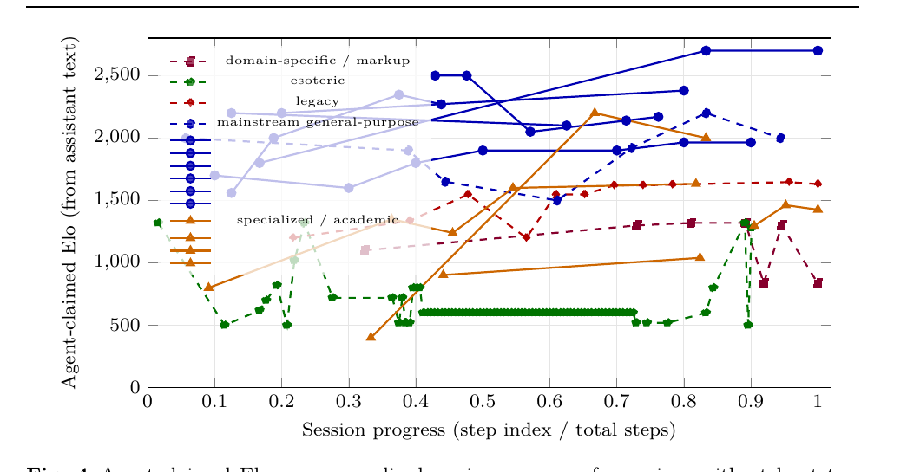 <!-- .element: style="max-height: 560px" -->

Note: L'Elo que l'agent s'attribue au fil de la session, par catégorie de langage (généralistes en haut, ésotériques en bas ; pointillés = trajectoires « zigzag », l'agent détecte et annule ses propres régressions).

---

## Backup · L'assembleur n'est pas mort

- Des projets phares écrivent **encore de l'assembleur à la main** : ffmpeg, VLC/x264, codecs : des noyaux SIMD optimisés, plus rapides que ce que produit le compilateur
- Même en **C, Rust ou Zig** : savoir ce qui se passe au niveau matériel (caches, vectorisation, branchements) **fait la différence** : jeux vidéo, codecs, calcul intensif
- « Legacy » dans notre taxonomie = une catégorie d'étude, pas un jugement : le bas niveau est un **savoir vivant**

Note: À relier au fossé : les derniers pourcents de performance exigent exactement cette maîtrise technique, celle que les agents n'ont pas encore démontrée à ce niveau (cf. le moteur assembleur : 1403 Elo mesurés, loin des espoirs de son auteur-agent).

---

## Backup · La méta-étude ésotérique : 5 cas

| Cas | Corpus d'entraînement existant | Résultat |
|---|---|---|
| Benchmark Brainfuck | ~5 000 dépôts jouets | **80/80** sur le critère du bench (meilleur score antérieur : **13,8 %** ; même famille de modèles : 12,5 %) |
| BFChess | aucun moteur préexistant | ~5,9 Mo de Brainfuck pur, protocole UCI |
| MnM | langage **vieux de 5 jours**, corpus mondial : **63 lignes** | **26/26** défis |
| ArnoldC | des hello-worlds ; compilateur dormant depuis ~2015 | 25/25 + **9 bugs du compilateur corrigés** |
| Triple interpréteur | — | 290 571 lignes, 38/38 tests |

**12,5 % → 100 % à même famille de modèles** : le **harnais agentique** (interpréteur dans la boucle, essais illimités) compte autant que le modèle.

Note: Méta-étude « Beyond Memorization: Coding Agents Can Master Esoteric Programming Languages » (en cours). Réplication inter-vendeurs non planifiée : Codex, pointé sur l'artefact fini, a formalisé le motif (projections de Futamura) et l'a ré-instancié : Whitespace→FALSE→FRACTRAN, validé contre le package CRAN Rfractran (4 000 pas du générateur de nombres premiers de Conway).

---

## Backup · Passer les tests ≠ maîtriser le métier

- **Sur-ajustement aux tests** : fuzzing contre un oracle fidèle à la spec → **54 des 80 solutions** échouent sur des entrées conformes à la spec (entiers > 255, une ligne de plus que les tests, un « \n » final) ; 26 sont vraiment générales : *saturer un oracle fixe ≠ correction générale*
- Le verdict d'un **expert reconnu de Brainfuck** : l'agent « produit des programmes qui passent les tests »… mais « n'écrit pas encore bien le Brainfuck ». Tri de lignes : **171 559 instructions** chez l'agent vs **moins de 400 octets** chez l'expert
- Et côté chiffres : **aucune surestimation n'a survécu à une mesure adversariale**, encore fallait-il la faire (cf. la punchline JIT, dégonflée par une simple expérience de contrôle)

Note: Comm. pers. avril 2026 (⚠️ demander la permission avant toute citation nominative publique ; ici anonymisée). Son image : « le Brainfuck veut être sculpté comme de l'argile ; beaucoup le manipulent avec des pinces, comme un échantillon radioactif, et l'agent fait pareil ». Alimente directement la slide « Soyons lucides : le fossé est là ».
